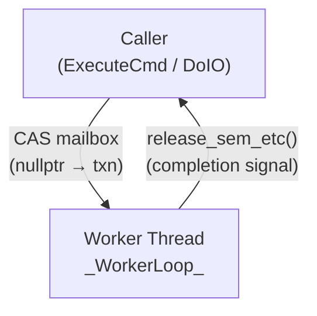
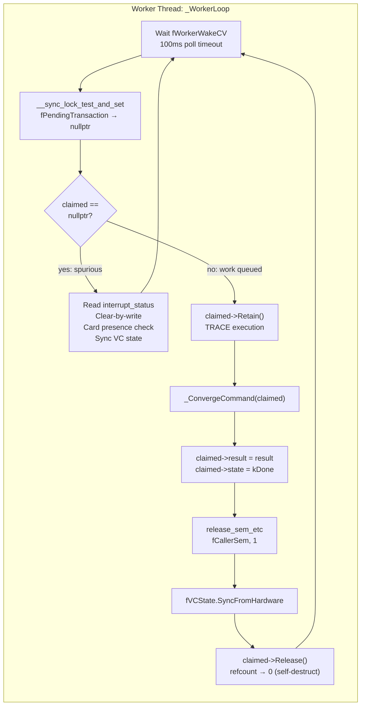
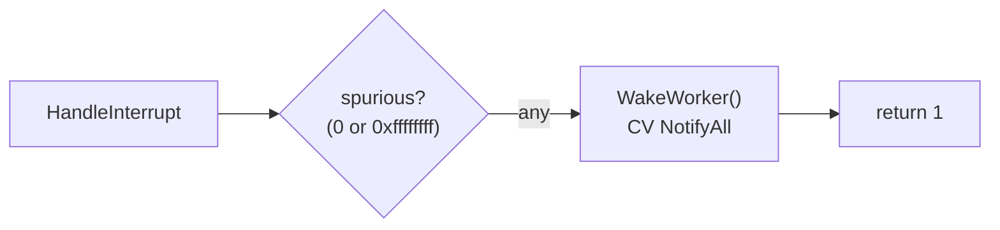
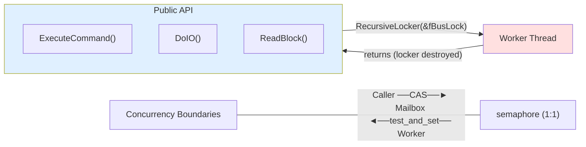
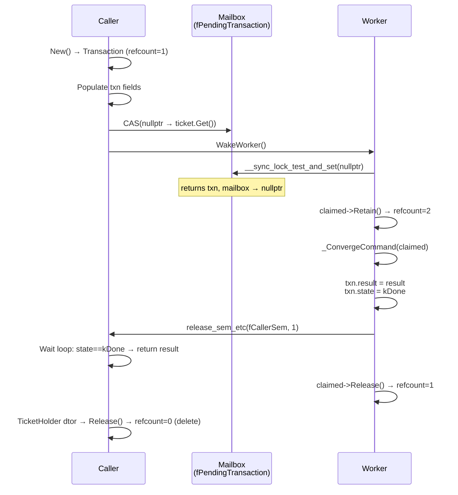

# SDHCI/MMC Bus Architecture — Worker-Driven Design

## 1. Motivation and Problem Statement

The BayTrail (BYT) SDHCI controller on the Samsung Chromebook 2 (WINKY) is notorious for unreliable, spurious, and late interrupts. The traditional ISR-first model — where the interrupt handler reads hardware state, updates driver state, and signals a waiting thread — breaks down because:

- **Spurious interrupts**: Interrupts fire when no command actually completed
- **Late interrupts**: Interrupts arrive significantly after the hardware finished executing a command  
- **Missing interrupts**: Interrupts never arrive at all for some commands

The previous design attempted to mitigate this with an ISR-first model — where the interrupt handler reads hardware state, updates driver state, and signals a waiting thread — but it broke down because spurious, late, and missing interrupts made reliable ISR-driven coordination impossible.

The current design uses a **worker-thread-driven** architecture where the ISR does almost nothing (spurious detection + WakeWorker only), and all hardware access is funneled through a single worker thread that polls for completion rather than relying on interrupts. A refcounted ticket mailbox provides lock-free communication between callers and worker, with a CV poll timeout ensuring the worker wakes even when the unreliable BYT interrupts never fire.

## 2. High-Level Architecture

### System Overview



### Worker Internal Flow



### ISR



### Key Principle: The ISR Does No Work

The ISR does **nothing** beyond filtering genuinely spurious interrupts (all-zeros or all-ones on an unpopulated IRQ line) and calling `WakeWorker()` via `ConditionVariable::NotifyAll()`. It reads the interrupt status register only to detect these two garbage patterns — it does not acknowledge any bits, does not process card presence events, and does not touch driver data structures.

This is intentional: on BayTrail, interrupts are unreliable. The ISR might fire for a completed command, or for garbage noise. Either way, the correct response is "check again" — not "process now." The worker thread handles all checking, including interrupt bit acknowledgment and card presence handling (moved from the ISR to the worker's spurious-wakeup path).

## 3. Concurrency Philosophy

### 3.1 Three Layers of Concurrency

The design uses three distinct concurrency mechanisms, each with a clear separation of concerns:

| Mechanism | Purpose | Scope |
|-----------|---------|-------|
| **Bus Lock** (`fBusLock`) | Caller serialization — ensures only one caller can queue work at a time | Public entry points only |
| **Double-Buffered Mailbox** (`fPendingTransaction`) | Zero-lock worker communication — atomic pointer exchange | Between caller and worker |
| **Counting Semaphore** (`fCallerSem`) | 1:1 completion signaling — fires immediately whether caller is waiting or not | Worker → Caller |

### 3.2 Bus Lock — Caller Serialization Only

The bus lock (`recursive_lock fBusLock`) exists solely to serialize public entry points against each other. It ensures that only one caller can queue work at a time — preventing multiple transactions from competing for the single SDHCI controller hardware.

**Critical design rule:** The worker thread never touches `fBusLock`. It communicates with callers entirely through the atomic mailbox pointer and the counting semaphore. This means:
- Private methods (`_ConvergeCommand`, `_ExecuteTransaction`) don't acquire or release the bus lock.
- The bus lock is acquired once at the top of each public entry point and held for the entire duration (including the wait loop).
- Since the worker doesn't need the bus lock, there's no deadlock risk between caller-held bus lock and worker operations.

This also means private methods cannot call other private methods that acquire the bus lock — a structural guarantee enforced by the design.

### 3.3 Double-Buffered Mailbox — Lock-Free Worker Communication

The mailbox is a single `volatile Transaction* fPendingTransaction` pointer:
- `nullptr` = no pending work (worker sleeping)
- non-null = caller has queued work, waiting for worker to consume

**Caller side:** Allocates a `Transaction` via `New()` (refcount=1), populates it, then wraps in a `TicketHolder` RAII wrapper. CAS from `nullptr → ticket.Get()` under the bus lock. If the CAS succeeds, the mailbox now points to the caller's transaction — ownership transferred. The `TicketHolder` destructor calls `Release()` when the function exits (whether normally or via timeout).

**Worker side:** Uses `__sync_lock_test_and_set(&fPendingTransaction, nullptr)` to atomically swap the mailbox pointer with `nullptr` and retrieve whatever was there before:
- Returns non-null → caller queued work; worker now owns it, mailbox is reset to `nullptr`
- Returns nullptr → mailbox empty (spurious wakeup); worker goes back to sleep

This is a **double-buffer** pattern: the mailbox alternates between pointing to the caller's transaction and pointing to `nullptr`. The pointer value itself encodes ownership. After processing, the worker releases its ref (refcount drops to 1), then releases the caller's ref (refcount drops to 0, transaction self-destructs).

### 3.4 Counting Semaphore — Guaranteed 1:1 Signaling

The counting semaphore (`sem_id fCallerSem`, created with `create_sem(0, "SDHCI caller sem")`) provides reliable completion signaling with the following properties:

- **Fires immediately:** If the worker calls `release_sem_etc(fCallerSem, 1)` before the caller calls `acquire_sem_etc()`, the semaphore count is already > 0. The caller's acquire returns immediately without blocking.
- **No lost notifications:** A counting semaphore's state (the integer count) persists across notifications and acquisitions. If the worker calls `release_sem_etc()` before the caller calls `acquire_sem_etc()`, the semaphore count is already > 0 and the caller returns immediately without blocking. There is no window where a notification can be missed.
- **Spurious wakeup handling:** The caller's wait loop checks `ticket.Get()->state == kDone` before each semaphore acquire. On timeout, it checks if the mailbox still points to its ticket (proves the worker hasn't claimed it yet) — if so, CAS resets mailbox to `nullptr` so the next caller finds an idle mailbox; otherwise the worker owns the ticket and will finish processing it harmlessly.

## 4. Transaction Struct

The `Transaction` struct is defined at file scope (not inside `SdhciBus`). It represents one command or data transfer operation:

```cpp
struct Transaction {
    enum State : int8 { kIdle = 0, kDone = 1 };

    uint8     command;      // SD/MMC command code
    uint32    argument;     // CMD argument register value
    uint16    replyType;    // Command response type bits
    uint16    transferMode; // Transfer mode register bits
    uint32*   response;     // Output buffer for R-type responses (nullable)
    bool      dataPresent;  // True if this is a data transfer (DMA)

    // Data phase fields — populated by DoIO wrappers.
    addr_t    dmaAddress;   // system_address register value
    uint16    blockSize;    // block_size.ConfigureTransfer() parameter
    uint32    blockCount;   // For multi-block transfers (DoIO)

    State     state;        // Set by worker to kDone on completion
    status_t  result;       // Set by worker (B_OK, B_TIMED_OUT, etc.)

    // Refcounting — heap-allocated, self-destructs when refcount reaches zero.
    int32     refcount;
    void      Retain();
    void      Release();
};
```

**Ownership model:** The caller heap-allocates a `Transaction` and immediately `Retain()`s it (refcount = 2). After CAS into the mailbox, the caller waits for completion. When the worker consumes the mailbox, it processes the transaction and writes `result`/`state`. The worker then `Release()`s its ref, followed by the caller `Release()`ing its ref — when refcount reaches zero, the transaction self-destructs.

## 5. Public Entry Points

### 5.1 ExecuteCommand

```text
1. Lock: BPrivate::RecursiveLocker locker(&fBusLock) — inline RAII lock, held for entire function
2. Check cached VC state: commandInhibit → B_BUSY, dataInhibit → B_BUSY
3. Determine replyType: personality override first, then spec table default
4. Determine transferMode from replyType and command code
5. Heap-allocate Transaction (New()), populate fields (refcount=1)
6. CAS mailbox from nullptr → ticket.Get() (under bus lock — safe; worker always leaves nullptr when idle)
7. WakeWorker() (CV NotifyAll — wakes worker regardless of current state)
8. Wait loop:
   a. Check: ticket.Get()->state == kDone → return ticket.Get()->result
   b. acquire_sem_etc(fCallerSem, 1, B_RELATIVE_TIMEOUT, 10s)
   c. If TIMED_OUT → check mailbox still points to our ticket; if so CAS reset to nullptr, return B_TIMED_OUT
   d. Loop back to (a)
9. TicketHolder destructor → txn->Release() — when refcount reaches zero, transaction self-destructs
```

**Key characteristics:**
- Heap-allocated transaction with refcounting — self-destructs when both caller and worker releases done
- Bus lock held for entire function duration via inline `BPrivate::RecursiveLocker` — no other caller can queue work while waiting
- Uses semaphore, not CV, for completion signaling — no lost notification window
- Wait loop handles spurious wakeups by re-checking transaction state after each acquire
- Timeout safety: if mailbox still points to our ticket, worker hasn't claimed it yet — CAS reset to nullptr so next caller finds idle mailbox

### 5.2 DoIO

```text
1. Lock: BPrivate::RecursiveLocker locker(&fBusLock) — inline RAII lock, held for entire function
2. Validate DMA buffer from IOOperation (check VecCount > 0)
3. Build single multi-block transaction (New(), refcount=1): set dataPresent=true, dmaAddress, blockSize, blockCount
4. CAS mailbox from nullptr → ticket.Get()
5. WakeWorker()
6. Wait loop (same as ExecuteCommand, but with 30s timeout)
7. TicketHolder destructor → txn->Release() — refcount reaches zero, transaction self-destructs
```

**Key characteristics:**
- Single monolithic multi-block transaction — Auto-CMD12 is essential for hardware-managed multi-block stop sequences on SDHCI controllers
- Convergence retry handles individual block failures at the worker level
- Same semaphore-based wait pattern as ExecuteCommand

### 5.3 ReadBlock

Used for reading EXT_CSD from eMMC cards (bypasses IOOperation construction). Identical pattern to DoIO but with a single block:

```text
1. Lock: BPrivate::RecursiveLocker locker(&fBusLock)
2. Check VC state (commandInhibit / dataInhibit)
3. Heap-allocate Transaction (New(), refcount=1), populate fields (dataPresent=true, isWrite=false, blockSize=512)
4. CAS mailbox, WakeWorker(), wait loop
5. TicketHolder destructor → txn->Release() — refcount reaches zero, transaction self-destructs
```

## 6. Worker Thread

### 6.1 _WorkerLoop

```cpp
while (fStatus != B_SHUTTING_DOWN):
    Wait on fWorkerWakeCV with 100ms poll timeout (B_RELATIVE_TIMEOUT)

    if fStatus == B_SHUTTING_DOWN: break

    // Attempt to claim mailbox — swap with nullptr
    claimed = __sync_lock_test_and_set(&fPendingTransaction, nullptr)

    if claimed == nullptr:
        // Spurious wakeup — mailbox was empty. Acknowledge any pending
        // interrupt bits, handle card presence changes, sync VC state, then sleep.
        uint32 intmask = fRegisters->interrupt_status;
        if (intmask != 0 && intmask != 0xffffffff) {
            fRegisters->interrupt_status |= intmask;  // clear-by-write
            if ((intmask & SDHCI_INT_CARD_INS) && fVCState.cardInserted)
                release_sem_etc(fScanSemaphore, 1, B_DO_NOT_RESCHEDULE);
        }
        fVCState.SyncFromHardware(fRegisters);
        continue  // go back to sleep (CV poll timeout ensures periodic wake)

    // claimed == caller's transaction — worker now owns it
    TRACE execution log

    // Execute with convergence (retry, OCR validation)
    result = _ConvergeCommand(claimed)

    WRITE RESULT INTO CALLER'S TRANSACTION
    claimed->result = result
    claimed->state = Transaction::kDone

    // Signal caller — semaphore fires whether or not caller is waiting
    release_sem_etc(fCallerSem, 1, B_DO_NOT_RESCHEDULE)

    // Update cached VC state from hardware
    fVCState.SyncFromHardware(fRegisters)

    // Release caller's ref; when refcount reaches zero, transaction self-destructs
    claimed->Release()
```

**Key characteristics:**
- Never touches `fBusLock` — communicates exclusively through atomic operations and semaphore
- Uses `__sync_lock_test_and_set(&fPendingTransaction, nullptr)` — mailbox is directly reset to `nullptr`, no scratch space involved
- CV wait includes 100ms poll timeout (`B_RELATIVE_TIMEOUT`) so worker wakes even when ISR never fires (BYT unreliable interrupts)
- Worker retains transaction before processing, releases after done — refcounting ensures safe lifetime
- Spurious wakeup: mailbox CAS returns nullptr; worker acknowledges pending interrupt bits, handles card presence changes (releases scan semaphore), syncs VC state, then sleeps again

### 6.2 WakeWorker

Called by both the ISR and callers to notify the worker that it should wake up. It's a `ConditionVariable::NotifyAll()` call. Since the worker is in a backing poll loop (not blocking on hardware), spurious wakeups are harmless — the mailbox CAS will simply fail if there's no work, and the worker goes back to sleep.

## 7. Command Convergence

### 7.1 _ConvergeCommand

The convergence wrapper handles retry loops, OCR validation, B_BUSY recovery, and personality-driven overrides:

```cpp
replyType = txn->replyType  // caller pre-computed this
if fPersonality != null:
    override = fPersonality->ReplyTypeFor(txn->command, fCardType)
    if override != 0: replyType = override

constraints = GetCommandConstraints(txn->command, fQuirks)
attempts = constraints.maxRetries + 1

for attempt in range(attempts):
    if attempt > 0: snooze(5ms * attempt)  // backoff between retries

    result = _ExecuteTransaction(txn, replyType, constraints.timeoutMs)

    if result == B_OK:
        if constraints.validateOCR and txn->response:
            if fPersonality and not fPersonality->ValidateOcr(*txn->response, fCardType):
                continue  // spurious OCR — retry internally
        return B_OK  // convergence reached

    if result == B_BUSY and attempt < attempts - 1:
        // Data command hit dataInhibit — bus reset recovery
        if constraints.needsBusResetOnError:
            TerminateBus()
            RestoreAfterReset()
        fVCState.SyncFromHardware(fRegisters)
        continue  // transient busy — retry

    if result == B_TIMED_OUT and attempt < attempts - 1:
        fVCState.SyncFromHardware(fRegisters)
        if not fVCState.cardInserted: break  // no card — don't retry
        continue  // transient timeout — retry

    if (result == SDHCI_INT_DATA_TIMEOUT or result == SDHCI_INT_DATA_CRC) and attempt < attempts - 1:
        // Data error — bus reset recovery for BYT data commands
        if constraints.needsBusResetOnError:
            TerminateBus()
            RestoreAfterReset()
        fVCState.SyncFromHardware(fRegisters)
        continue  // transient data error — retry

    return result  // hard error or last attempt exhausted

return B_TIMED_OUT  // retries exhausted
```

**Key characteristics:**
- Convergence is a **worker-local** concept — callers see only success or final failure, not intermediate retries
- OCR validation filters spurious responses from uninitialized BayTrail registers
- Card presence check prevents retrying when the card was genuinely removed
- Personality-driven overrides handle BayTrail-specific quirks (CMD12 as R1b)
- B_BUSY triggers bus reset recovery for data commands (needsBusResetOnError)
- DATA_TIMEOUT and DATA_CRC errors trigger bus reset recovery for BYT data commands

### 7.2 _ExecuteTransaction

The single-attempt inner loop — one poll for command completion:

```
// Drain stale interrupt bits BEFORE SendCommand (clear-by-write)
// BayTrail accumulates CMD_CMP/TRANS_CMP from previous drain writes;
// if not drained first, poll loop detects them as "already complete"
// and exits immediately without waiting for real command completion.
// Also reads + clears any pending bits from prior transactions.
uint32 stale = fRegisters->interrupt_status;
if (stale != 0 && stale != 0xffffffff)
    fRegisters->interrupt_status |= stale;

// Configure hardware registers based on transaction fields
fRegisters->argument = txn->argument
if txn->dataPresent:
    fRegisters->system_address = txn->dmaAddress
    fRegisters->block_size.ConfigureTransfer(txn->blockSize, ...)
    fRegisters->transfer_mode = txn->transferMode
else:
    fRegisters->transfer_mode = txn->transferMode

fRegisters->command.SendCommand(txn->command, replyType)

// Poll loop for CMD_CMP / TIMEOUT / DATA_TIMEOUT / DATA_CRC / ERROR
for i in range(pollBudget):  // ~3000 iterations ≈ 6 seconds
    intStatus = fRegisters->interrupt_status

    if intStatus & CMD_CMP: clear flag; break
    if intStatus & TRANS_CMP: clear flag; break
    if intStatus & DATA_TIMEOUT: clear flag; return SDHCI_INT_DATA_TIMEOUT
    if intStatus & DATA_CRC: clear flag; return SDHCI_INT_DATA_CRC
    if intStatus & COMMAND_TIMEOUT: reset lines; return B_TIMED_OUT
    if intStatus & ERROR: clear flag; break
    snooze(2ms)

// Read response if applicable
if replyType == k32BitResponse and txn->response != null:
    *txn->response = fRegisters->response[0]
else if replyType == k128BitResponse:
    copy all 4 response registers to txn->response[]

// R1b busy-wait (for commands like SELECT_DESELECT_CARD, SD_ERASE)
if replyType == kR1bType and no transfer mask set:
    poll present_state.DataInhibit() for ~2000 iterations ≈ 1 second

return B_OK
```

**Key characteristics:**
- Stale bit drain happens BEFORE SendCommand (clear-by-write) — clears accumulated bits from BayTrail's unreliable interrupt handling; also done in worker's spurious wakeup path for card presence interrupts
- Polls hardware registers directly — does not rely on interrupts
- BYT controllers are notorious for spurious/late/missing interrupts; polling with a generous timeout is more reliable
- DATA_TIMEOUT and DATA_CRC detection provides error feedback to convergence loop for retry
- The response is written directly into the caller's transaction struct (worker owns the claimed pointer)
- R1b busy-wait polls the data inhibit flag after command completion — standard SD/MMC behavior
- DataInhibit check removed from worker — B_BUSY handling done via convergence retry with bus reset recovery

## 8. VirtualControllerState Cache

The `VirtualControllerState` struct maintains a cached view of hardware state, updated by the worker after each command attempt:

```cpp
struct VirtualControllerState {
    bool commandInhibit;
    bool dataInhibit;
    bool cardInserted;
    bool regulatorStable;
    
    card_type cardType;
    uint8 baseClockMHz;
    bool presetModeEnabled;
    bool highSpeedEnabled;
    int dataWidthBits;       // 1, 4, or 8
    uint32 currentClockKHz;
    
    void SyncFromHardware(struct registers* regs) {
        commandInhibit = regs->present_state.CommandInhibit();
        dataInhibit = regs->present_state.DataInhibit();
        cardInserted = regs->present_state.IsCardInserted();
        regulatorStable = regs->present_state.RegulatorStable();
    }
};
```

**Usage:**
- Public entry points check `commandInhibit` and `dataInhibit` before queuing work — avoids sending commands when the hardware can't accept them
- Convergence wrapper checks `cardInserted` to decide whether to retry after timeout
- Worker syncs VC state from hardware after each transaction completion

## 9. Interrupt Handler

```cpp
int32 SdhciBus::HandleInterrupt() {
    // Only filter spurious interrupts — zero bit acknowledgment
    uint32 intmask = fRegisters->interrupt_status;
    if (intmask != 0 && intmask != 0xffffffff) {
        // Not spurious — worker will acknowledge bits in _ExecuteTransaction
        // before SendCommand (stale bit drain)
    }

    // Wake worker — "check again" notification
    WakeWorker();

    return 1;  // interrupt handled
}
```

**Key characteristics:**
- ISR does **nothing** beyond spurious interrupt detection and `WakeWorker()`
- No bit acknowledgment — all interrupt bit clearing moved to the worker's `_ExecuteTransaction` (stale bit drain before SendCommand)
- No card presence handling — moved to worker's spurious-wakeup path (if needed)
- `WakeWorker()` is a CV NotifyAll — wakes the worker regardless of current state
- Zero hardware reads beyond interrupt_status — no state updates, no response processing
- Spurious patterns (all-zeros or all-ones on unpopulated IRQ line) are detected but not acted upon — the correct response is always "check again"

## 10. BayTrail Personality

The `BayTrailPersonality` class implements `ControllerPersonality` for BYT-specific quirks:

| Quirk | Implementation | Spec Section |
|-------|----------------|--------------|
| Preset value registers broken | Disables preset mode in `PostResetInit()` | 12.2 |
| CMD12 needs busy response | Overrides reply type to R1b in `ReplyTypeFor()` | 12.3 |
| Timeout clock from SD domain | Returns true from `TimeoutClockUsesSDClock()` | 12.1 |
| eMMC timeout clock = 1 MHz | Returns 1000 kHz from `GetTimeoutClockKHz()` | 12.7 |
| OCR validation | Rejects garbage values (0, 0xffffffff, 0xcccccccc, 0x55555555) in `ValidateOcr()` | — |

The personality is set by the platform layer (ACPI/PCI) based on HID/UID detection. If no personality is set, all defaults are used (zero cost for standard SDHCI controllers).

## 11. Command Constraints Dispatch

`GetCommandConstraints()` is an inline function in the header that derives per-command retry behavior from the quirks bitmask:

```cpp
inline CommandConstraints GetCommandConstraints(uint8 command, uint32 quirks) {
    // MMC_SEND_OP_COND / SD_SEND_OP_COND: 20 retries, OCR validation (power-on delay quirk)
    // SD_APP_CMD: 3 retries, 200ms timeout (ACMD55 frequently times out on BYT)
    // SD_STOP_TRANSMISSION: needsBusResetOnError (STOP_TRANSMISSION_BUSY quirk)
    // SELECT_DESELECT_CARD / SD_ERASE: needsBusResetOnError (CARD_ON_NEEDS_BUS_ON quirk)
    // All others: no retries at this level
}
```

This is a policy function, not a data structure — different controllers may return different policies for the same command code. The quirks bitmask drives the decision; the personality handles lifecycle hooks.

## 12. Bus Lock Architecture Summary



The bus lock is a pure caller serialization mechanism. It prevents multiple callers from simultaneously queueing work onto the single SDHCI controller. The worker thread has no awareness of it — it communicates through atomic operations and semaphore signaling. This eliminates the deadlock risk that plagued earlier designs where the caller-held bus lock prevented the worker from CAS-consum­ing the mailbox while the caller slept.

## 13. Transaction Lifecycle



**Guarantees:**
1. **No lost notifications:** Semaphore count persists; notification before or after wait is both handled
2. **No race windows:** CAS from nullptr ensures only one caller can queue at a time (bus lock protects the CAS; mailbox nullness protects against worker already consuming)
3. **No epoch or generation counter needed:** Mailbox nullness + local transaction state == kDone provides sufficient ownership proof — the worker writes directly into the caller's heap-allocated struct
4. **Safe lifetime via refcounting:** Transaction is allocated via `New()` with refcount=1, caller wraps in `TicketHolder` RAII; self-destructs when both caller and worker releases are done (refcount reaches zero)

## 14. Error Handling

### Timeout
- ExecuteCommand: 10-second timeout on semaphore acquire
- DoIO/ReadBlock: 30-second timeout (data transfers may take longer)
- Timeout propagates to caller — no recovery attempted at this level

### Hardware Busy / Inhibit
- `commandInhibit` → B_BUSY (command cannot be sent)
- `dataInhibit` → B_BUSY (data transfer cannot proceed)
- Checked by both callers and worker before sending commands

### Convergence Failures
- Retries exhausted → final error code returned to caller
- OCR validation failure → internally retried (spurious response, not real error)
- Card removed during retry → abort immediately (no point continuing)

### B_BUSY / Inhibit
- `commandInhibit` or `dataInhibit` → B_BUSY returned to convergence loop
- For data commands with `needsBusResetOnError`: triggers bus reset recovery (TerminateBus + RestoreAfterReset) before retry
- Convergence retry handles transient inhibit conditions

### Bus Reset on Error
Some commands have `needsBusResetOnError` set in their constraints. When these fail, the MMC layer handles bus reset via `RestoreAfterReset()`, which:
1. Calls `TerminateBus()` (power off, disable interrupts)
2. Re-enables power if card is present
3. Applies BayTrail power-on delay (10ms)
4. Reconfigures initialization clock

## 15. Initialization Flow

```text
SdhciBus constructor:
  1. Initialize bus lock (recursive_lock_init)
  2. Create caller semaphore (create_sem(0, ...))
  3. Install IO interrupt handler
  4. Reset controller (software reset)
  5. Sync VC state from hardware
  6. Set default interrupt masks
  7. Apply personality PostResetInit() if set

MMCBus constructor:
  1. Call fController->execute_command(GO_IDLE_STATE, ...) — bus lock acquired internally via BPrivate::RecursiveLocker
  2. ExecuteCommand(MMC_SEND_OP_COND / SD_SEND_OP_COND) with convergence
  3. ExecuteCommand(ALL_SEND_CID), (SEND_CSD), etc.
```

Each public entry point acquires the bus lock inline via `BPrivate::RecursiveLocker` — there are no separate AcquireBus/ReleaseBus methods. The MMCBus layer is a caller, not a special code path. This ensures consistency: if it works during init, it works at runtime, and vice versa.

## 16. Design Principles Summary

1. **ISR does no work.** Acknowledge + wake worker only. No hardware reads, no state updates.
2. **Worker is sole HW accessor.** All command execution, response reading, and state updates happen in the worker thread.
3. **Caller serialization via bus lock.** Only one caller queues at a time. Worker doesn't touch bus lock.
4. **Lock-free mailbox communication.** Atomic pointer exchange replaces shared state with explicit ownership transfers.
5. **Counting semaphore for reliable signaling.** No lost notification window; fires immediately whether caller is waiting or not.
6. **Heap-allocated refcounted transactions.** Self-destructs when both caller and worker releases are done; bounded lifetime via refcounting.
7. **Convergence is worker-local.** Callers see only success or final failure — intermediate retries are invisible.
8. **VC cache avoids direct hardware reads for common checks.** Command/data inhibit and card presence are cached by the worker.
9. **Polling over interrupts.** BYT controllers are unreliable; polling with generous timeouts is more robust than relying on IRQs.
10. **Public API is consistent.** Init-time commands use the same path as runtime commands. If it works in one, it works in the other.
