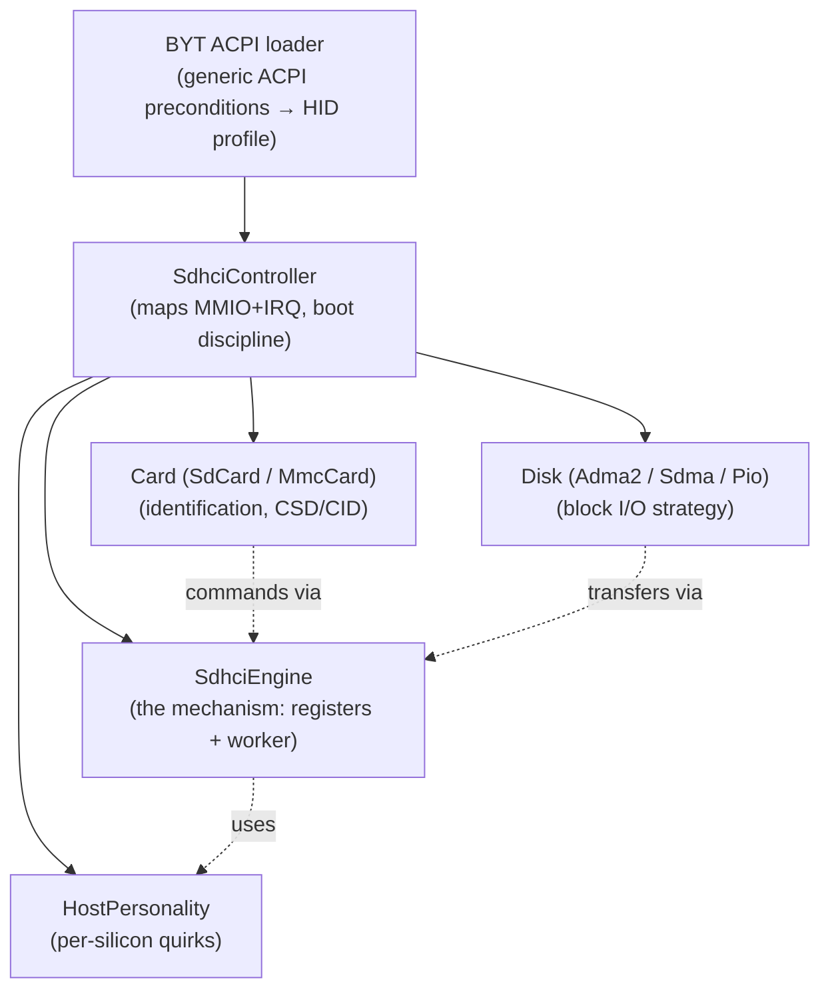
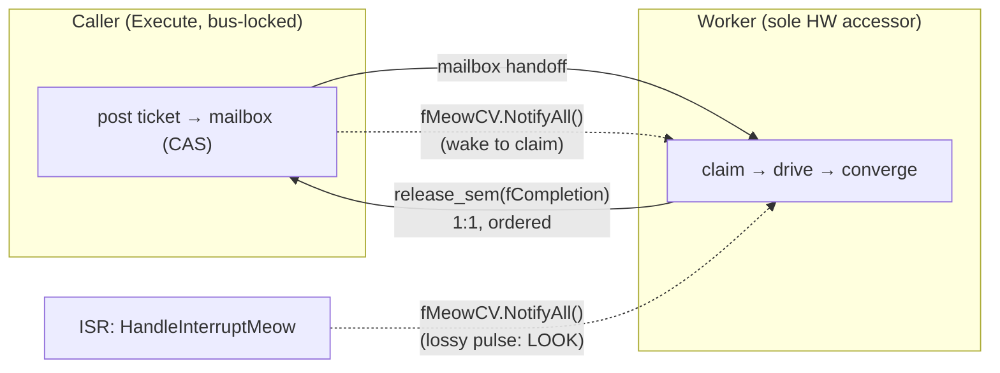
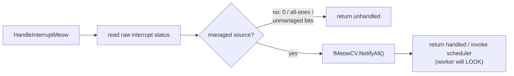
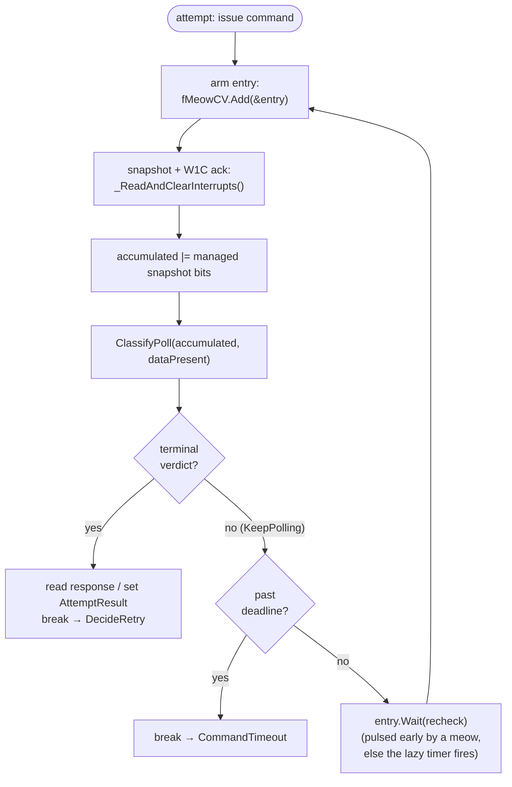
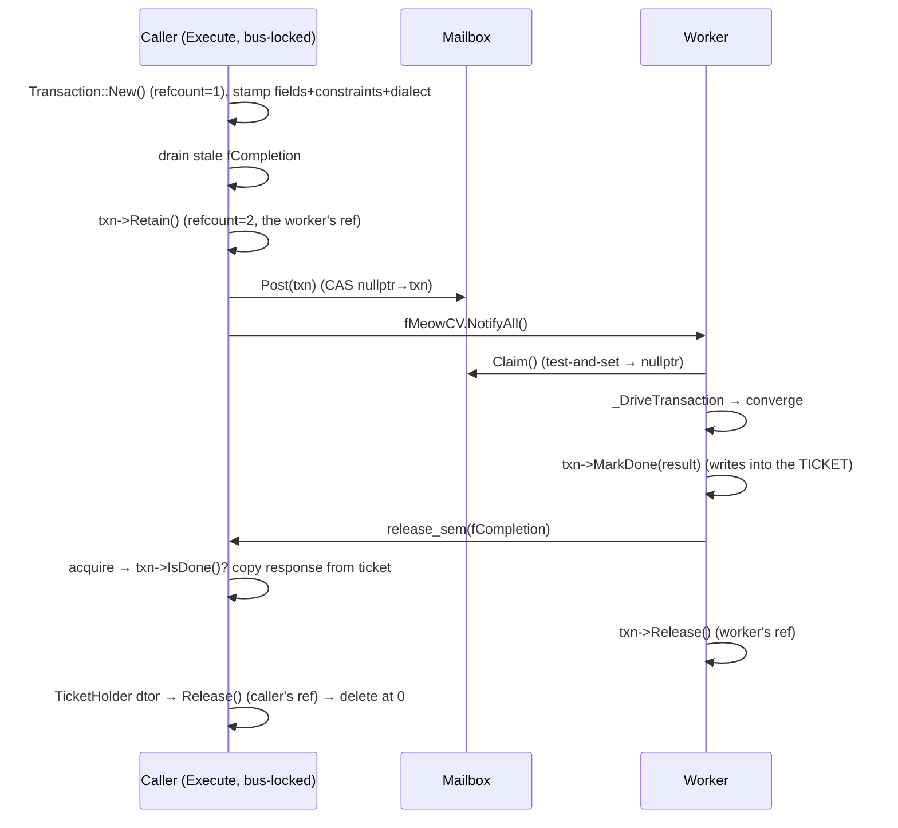

# sdhci_embedded — The Meow Bus Architecture

The normative Winky/Bay Trail hardware, electrical, timing, IOSF, and DMA
contract lives in
[`../hardware/winky-bay-trail-sdhci.md`](../hardware/winky-bay-trail-sdhci.md).
This document defines the driver's software architecture and concurrency model.

> Supersedes `sdhci-worker-architecture.md`. That earlier record described an
> older, monolithic `SdhciBus` implementation. This document describes the
> shipping `sdhci_embedded` add-on: the same hard-won hardware discipline,
> re-expressed as a small stack of clean classes with a pure, host-tested policy
> core. Where the two disagree, **this** document and the code win.

## 1. Motivation and Problem Statement

The Bay Trail (BYT) SDHCI controller on the Samsung Chromebook 2 (WINKY) does
not behave like the MMC/SDHCI specification imagines. Its interrupt line is, in
the words that shaped this design, *insane*: interrupts arrive **early** (before
you have even looked), **doubled**, **late**, **spurious**, **meant for another
command**, or **never at all**. The controller will service a burst of commands
at full ISR speed and then, for no visible reason, go silent and require manual
kicking. It is both extremes at once — too fast and too slow.

The classic ISR-first model — where the interrupt handler reads hardware state,
acknowledges bits, updates driver state, and wakes a waiting thread — collapses
on this silicon, because the ISR cannot trust that a signal corresponds to any
particular command, or to a real event at all. Worse, **hammering this bus in a
tight polling loop can wedge it**: Intel's controller wants a "soft" bus and is
deeply unreliable under pressure.

The design answer is the **meow bus**:

- The interrupt is modeled as a **cat**. The ISR only *meows* — "something
  happened, maybe." It reads only enough raw status to reject line noise,
  acknowledges no bits, and interprets no command state. A meow is an
  **unordered hint**, never a fact and never a counter.
- A single **worker thread** is the cat's owner. It is the sole semantic and
  mutating accessor of the hardware. When it is nudged (or a lazy timer fires),
  it gets up and *looks* — it snapshots and acknowledges the registers, retains
  evidence in software, and lets a pure policy decide what is real.
- Serialization comes from **stateful convergence in the worker**, not from
  counting transactions or trusting interrupt ordering. The hardware is far too
  unreliable to count on.

The result is a driver that is **as fast as interrupts when the line behaves,
and as slow as polling when it does not** — and never busy-spins the bus.

## 2. High-Level Architecture

### 2.1 Object hierarchy — a stack of clean classes, not a chain of modules

`sdhci_embedded` is one flat kernel add-on. Discovery and lifetime flow down a
short ownership chain; there is exactly one of each (a *container-of-1*: no slot
arrays, because this is a soldered-down embedded eMMC/SD controller, not a PCI
card cage).

- **BYT ACPI loader** — mirrors Haiku's generic ACPI SDHCI preconditions, then
  maps a Bay Trail controller HID to a personality. `_UID` identifies an ACPI
  instance rather than a card role, so it cannot prevent a known eMMC host from
  loading. The composed Winky image makes this the sole SDHCI owner.
- **SdhciController** — acquires MMIO + IRQ, owns the `SdhciEngine`, selects the
  `HostPersonality`, and holds the single `Card` and single `Disk`. It runs the
  boot sequence and publishes the disk node.
- **SdhciEngine** — the subject of this document: the *mechanism*. It owns the
  register block, the worker thread, the bus lock, the lock-free mailbox, the
  completion semaphore, and the meow condition variable.
- **HostPersonality** — the per-silicon quirk object (OCR validation, reply-type
  overrides, post-reset fixups). Bay Trail is one personality; a permissive
  Generic one is the default.
- **Card / Disk** — identification and block-I/O strategy. Both reach the
  hardware only by asking the engine to `Execute()` a command.

### 2.2 Mechanism vs. policy — the pure core

The single most important structural decision is that **judgement is separated
from register-poking** and lives in pure, header-only, host-tested code:

| Header | Role | Tested off-target by |
|--------|------|----------------------|
| `Convergence.h` | *What does one polled status word mean? Retry or stop?* (`IsSpuriousMeow`, `InterpretInterruptStatus`, `ClassifyPoll`, `DecideRetry`) | `test_convergence.cpp` |
| `Contract.h` | *The written-down assumptions about the silicon* — one home, two enforcement venues (host mock obeys them, on-target trace can shout) | `test_contract.cpp` |
| `Transaction.h` | Ref-counted ticket, lock-free mailbox, virtual-controller state | `test_transaction.cpp`, `test_concurrency.cpp` |
| `Matcher.h`, `Personality.h`, `Csd.h`, `Command.h` | BYT HID profile, quirks, CSD/CID decode, opcode traits | `test_matcher.cpp`, `test_personality.cpp`, `test_csd.cpp`, `test_command.cpp` |

`SdhciEngine.cpp` is deliberately *thin*: it is only the hands. Every "should we
believe this / should we retry" decision is a call into the pure core, so the
dangerous reasoning is proven on a workstation with a `FakeController` that can
model garbage hardware — meowing too often, not at all, or at random — before it
ever touches metal.

### 2.3 The two signals of the meow bus

Two signals travel in opposite directions and are **deliberately different
primitives**:

- **`fMeowCV` (ConditionVariable) — the meow, ISR/caller → worker.** A *lossy*
  pulse (`NotifyAll`). It carries no data and counts nothing. A counting
  semaphore would be *wrong* here: it would bank pulses and later replay them as
  a burst of phantom rechecks that hammer the fragile bus. With a CV, a missed
  pulse simply degrades to a timed recheck. (Haiku's `ConditionVariable` is
  happy in interrupt context; `NotifyAll` there is idiomatic.)
- **`fCompletion` (counting semaphore) — completion, worker → caller.** This is
  1:1 and ordered: a completion must **never** be lost. The count persists
  whether or not the caller is already waiting, and the caller re-checks its
  ticket's `IsDone()` to reject a *stale* nudge left by an earlier abandoned
  command.

> The critique "meows are unordered pulses, not transaction counters" applies to
> the **meow only**. The completion path is a real 1:1 delivery and stays a
> semaphore.

### 2.4 The ISR filters, but does not decide

`HandleInterruptMeow()` performs one deliberately non-semantic read: raw
interrupt status. It rejects zero, all-ones, and words with no source in the
driver's signal mask. It never acknowledges a bit, reads a response, interprets
a command phase, handles card presence, or mutates driver state. A plausible
source remains only a content-free hint.

Because the meow is only a hint, an **early, late, doubled, spurious, or
wrong-command** meow is harmless — the worker's accumulated poll evidence plus
stateful convergence decide what actually happened. A meow that arrives with no
one waiting is simply lost, which turns into a timed recheck on the next loop.
When a waiter is released, the ISR asks Haiku to schedule promptly so the worker
can lower the level-triggered source before it retriggers.

## 3. The Convergence Loop — the heart of the meow bus

Both the idle dispatch wait and the in-command wait share one shape:

> **Pre-armed poll → CV wait → re-poll. Rinse and repeat.**

The steps, and *why each one is exactly where it is*:

1. **Arm before looking.** `fMeowCV.Add(&entry)` enqueues the wakeup entry
   *before* the poll. If a meow fires while we are reading the status register,
   it marks our already-armed entry, so the `Wait()` below returns immediately
   instead of losing the pulse. This closes the classic lost-wakeup window
   without a lock.
2. **Snapshot, acknowledge, accumulate.** `_ReadAndClearInterrupts()` reads one
   status snapshot and immediately write-1-clears the managed bits so a
   level-triggered source cannot stay asserted. The worker ORs that evidence
   into an attempt-local accumulator before classification. Thus an early
   `CommandComplete` is retained after acknowledgement until a later
   `TransferComplete` arrives, and a later error still outranks partial
   completion. A meow never aborts or re-issues a command; `ClassifyPoll` remains
   the sole arbiter of "are we converged?"
3. **Terminal → handle.** On a terminal verdict, read the response, set the
   attempt result (including the OCR sanity check), and leave the loop to the
   retry decision.
4. **Deadline → timeout.** A wall-clock deadline per attempt (the command's own
   `timeoutMs` when it set one, else ~2 s) bounds the wait. Blowing the
   deadline is the graceful "the bus went silent" fallback — it becomes a
   `CommandTimeout` the retry policy can act on.
5. **CV wait, then re-poll.** `entry.Wait(B_RELATIVE_TIMEOUT, recheck)` sleeps
   until a meow pulses us (fast as interrupts) or the deliberately *lazy* recheck
   timer (~2 ms) fires (slow as polling). Either way we loop and look again. We
   **never busy-spin**: a tight loop can wedge this bus.

In the common case, the very first poll after issuing finds the command still in
flight, so we arm and wait; the completion interrupt meows almost immediately;
`Wait()` returns; the re-poll sees completion; done. **You should almost always
see one wait that gets pulsed — repolls and retries only show up when the bus is
genuinely screwed.** That is the design working, not failing.

Before issue, the engine treats `R1b` as a data-line command even without a
payload: both Command Inhibit and Data Inhibit must clear. This mirrors Linux's
`sdhci_data_line_cmd()` rule. Card selection itself uses plain R1, also matching
Linux's MMC core; R1b remains for commands that actually require busy signaling,
such as eMMC CMD6 and the Bay Trail CMD12 override.

### 3.1 Stateful convergence is the serializer

There is no transaction counter and no reliance on interrupt ordering. Each
attempt accumulates acknowledged status evidence until it reaches a terminal
`PollVerdict`; then the worker updates its
`VirtualControllerState` from present-state registers and asks the pure
`DecideRetry()` what to do next: **succeed**, **fail**, or **retry (optionally
with a bus reset first)**. Convergence is entirely worker-local — callers see
only the final success or failure, never the intermediate retries. This local,
stateful convergence *is* the serialization mechanism; it is why the engine can
tolerate a controller that lies about ordering.

### 3.2 Stale-bit drain before issuing

Bay Trail latches and **accumulates** CMD_CMP/TRANS_CMP bits from earlier
commands. If those stale bits are not cleared before `SendCommand`, the very
first poll of the next attempt would read them and `ClassifyPoll` would call the
command already complete — an instant *false success*. So `_IssueToHardware`
drains stale interrupt bits immediately before issuing. Each write-1-to-clear is
followed by a volatile readback and the drain repeats until the managed bits are
stable-clear (skipping the spurious all-ones/all-zeros word). If managed
completion remains after the bounded drain, the engine refuses to issue and
lets convergence recover the lines rather than accepting the previous
command's response. This is a documented hardware necessity, not hygiene.

## 4. Concurrency layers

| Mechanism | Purpose | Who touches it |
|-----------|---------|----------------|
| **Bus lock** (`mutex fBusLock`) | Serialize callers against each other; only one command is in flight | Callers only — the worker **never** takes it |
| **Lock-free mailbox** (`TransactionMailbox`) | Single-slot atomic handoff of a ticket from a bus-locked caller to the lockless worker | Caller posts (CAS), worker claims (test-and-set), caller reclaims on timeout (CAS) |
| **Meow CV** (`ConditionVariable fMeowCV`) | Lossy wake pulse: "LOOK" | ISR + caller pulse; worker waits |
| **Completion sem** (`sem_id fCompletion`) | 1:1 ordered completion signal | Worker releases; caller acquires |

The bus lock is held for the **entire** duration of `Execute()`, including the
wait, so callers are fully serialized. The worker communicates purely through
the atomic mailbox and the two signals, so it never needs — and must never
take — the bus lock. That asymmetry is what removes the deadlock hazard that
plagued lock-sharing designs.

## 5. The transaction ticket and the vanishing caller

Command state lives in a **heap-allocated, reference-counted `Transaction`
ticket**, never on the caller's stack, and this is precisely what makes a
**vanishing caller safe** — the property the external (IORequest) data path
depends on.

Why this shape:

- **The worker writes results into the ticket, never into caller storage.** So
  if the caller has already returned (timed out, or its IORequest was
  cancelled), the worker's final write lands harmlessly in the ref-counted
  ticket — no use-after-free, no scribbling on a dead stack, no corrupted bus.
- **The caller re-checks `IsDone()` under the completion semaphore.** A stale
  completion left by an earlier abandoned command cannot be mistaken for this
  command's success; the caller keeps waiting for *its own* ticket to be
  published.
- **On timeout, the caller tries to `Reclaim()` its ticket.** If the worker
  already claimed it, the worker owns the reference and will `Release()` after
  `MarkDone()`; the caller just drops its own reference. Either way the ticket
  lives exactly as long as it is referenced.

> **Historical note / forward intent.** The mailbox + 1:1 delivery originally
> defended against a *layered* caller stack in the old driver, where each layer
> had its own timeout and a caller could abandon a command mid-flight. Now that
> the engine is a single integrated layer, that specific motivation is gone —
> but the *invariant it enforced* is exactly what the IORequest path still
> needs: **a caller can vanish without exploding the bus.** The ticket/refcount
> model is retained deliberately as that safety net. The eMMC/ADMA2 path uses
> synchronous, bus-locked, ticketed IOScheduler operations. The removable-SD
> recovery path uses one serialized overlay-owned request worker and copies
> through a contiguous staging buffer; each staged media command still resolves
> through the same timeout-and-reclaim path. Any future simplification of the
> mailbox must preserve this property.

## 6. Command constraints are load-bearing

Per-command policy is **not** cosmetic. `GetCommandConstraints(opcode, quirks)`
returns the retry budget, timeout, OCR-validation flag, and bus-reset-on-error
policy for each opcode, and that policy **travels on the `Transaction` itself**
(so a worker still finishing a timed-out command reads *its* ticket's
constraints, never state a newer caller is setting up). Examples that must be
preserved:

- `MMC_SEND_OP_COND` / `SD_SEND_OP_COND` — many retries with OCR validation
  (uninitialized Bay Trail registers return garbage OCR that must be filtered,
  not believed).
- `SD_APP_CMD` / ACMD55 — few retries, short timeout.
- `SD_STOP_TRANSMISSION`, `SELECT_DESELECT_CARD`, `SD_ERASE` —
  `needsBusResetOnError`.

Different personalities may return different policy for the *same* opcode. This
per-opcode special-casing is a hard-won rationalization of nasty hardware, not
incidental detail.

## 7. VirtualControllerState

The worker keeps a small `VirtualControllerState` cache — command/data inhibit,
card-inserted, and regulator readiness — updated at attempt boundaries.
Regulator readiness is read from the SDHCI 4.10+ indication when that register
contract exists and treated as satisfied on older hosts after their profile
settle sequence. `DecideRetry` consults the cache (e.g. do not keep retrying a
command when the card was genuinely removed). It is a worker-local model.

## 8. HostPersonality (Bay Trail quirks)

The personality is the per-silicon quirk seam, kept out of the mechanism:

- **`ValidateOcr(ocr, dialect)`** — rejects garbage OCR from uninitialized
  registers (drives the `SpuriousOcr` retry).
- **`OverrideReplyType(command, dialect, out)`** — e.g. Bay Trail's CMD12 must be
  treated as R1b.
- **`PostResetInit(target)`** — post-software-reset fixups (e.g. disabling
  preset-value mode via the one register hook, `DisablePresetValueMode`).

The Generic personality is permissive and is the default; Bay Trail is selected
by the BYT ACPI loader.

## 9. Boot discipline

`SdhciController::Boot()` runs synchronously on the device_manager thread — this
is the single **active init**: select the personality from the ACPI HID profile
(`_SelectPersonality`), map MMIO + IRQ from `_CRS` (`_MapResources`), clear the
Bay Trail OCP timeout over the IOSF-MBI sideband *before any SDHCI register
access* (`_ApplyOcpFixup`, quirk-gated and a soft dependency), bring the engine
up (`fEngine.Init` = reset, VDD, 400 kHz identification clock, worker spawn),
route the hardware line into the meow (`_InstallInterrupt`, only *after* the
worker's condition variable exists), identify the card, and publish the `Disk`
node to devfs — that last step is what lets boot-from-SD win the race against the
RAMDisk. Identification uses the *same* `Execute()` path as runtime traffic: if
it works at init, it works at runtime, and vice versa.

Because this controller can host boot media, the Winky BSP composes
`sdhci_embedded`, its `iosf_mbi` dependency, and both `kernel/boot` links into
`haiku.hpkg`. Haiku's stage-two loader exposes that package before ordinary
device-manager discovery; loose non-packaged add-ons are not visible yet.

Boot never touches hot-plug: either the card is present now and we bind it, or
it is not. Only *after* publish do we conditionally start the watcher, and it
handles exclusively **future** events.

### 9.1 Thread topology

The whole point of the conditional watcher is that the thread count is a
function of the slot, and there is never a hot-plug thread at boot. Per bound
controller:

| Thread / context | Priority | Lifetime | Present when | Role |
|---|---|---|---|---|
| **device_manager init** | caller's | transient (returns after `Boot()`) | always | The one active init: map, reset, identify, publish. Runs `Boot()` synchronously, then leaves. |
| **Engine worker** (`sdhci_emb worker`) | `B_NORMAL_PRIORITY` | whole controller lifetime | always | The meow bus's sole semantic/mutating hardware owner: drives transactions, acknowledges snapshots, and idle-drains late sources. Exactly one. |
| **SDMA request worker** (`sdhci_embedded SDMA I/O`) | `B_NORMAL_PRIORITY + 2` | whole disk lifetime | **removable SD profile only** | Serializes `IORequest`s, stages whole-sector windows, and notifies each request exactly once. It never uses `IOSchedulerSimple`. |
| **Hot-plug watcher** (`sdhci_emb watcher`) | `B_LOW_PRIORITY` | whole controller lifetime | **removable slot only** | Polls `CardPresent()` every 500 ms for FUTURE insert/remove. **Never spawned for soldered eMMC.** |
| **ISR** (interrupt context) | — | per interrupt | always (after `_InstallInterrupt`) | Reads raw status only to reject empty/floating/unmanaged sources, then emits one content-free `NotifyAll`; never acknowledges or interprets command state. |
| **Caller / IORequest threads** | external | external | on traffic | Post asynchronous requests to the selected disk path. They may vanish (see §5) without harming the bus. |

So a **removable SD** controller runs three long-lived threads of its own
(engine worker + SDMA request worker + watcher). A **soldered eMMC** controller
runs the engine worker plus the captive scheduler threads used by its ADMA2
path. The hot-plug gate is `MatchProfile::removable`, resolved at
`_SelectPersonality` and checked in `_StartWatcher` — no probing, no card-detect
capability sniffing at boot.

## 10. Host test surface

Because the dangerous reasoning is pure, it is proven off-target. The suite
(`tests/`) currently runs green at **86 tests / 399 checks**, covering:

- `convergence` / `contract` — status-word interpretation, spurious filtering,
  ISR source filtering, snapshot acknowledgement, software accumulation of
  split completion, late-error precedence, storm-safe idle drain, the
  data-command completion invariant, and retry decisions.
- `transaction` / `concurrency` / `mailbox` / `vcstate` — ticket refcount
  lifecycle, mailbox CAS protocol, reclaim-on-timeout, virtual-controller
  readiness gates, and a threaded caller↔worker stress rail that asserts *no
  false success* and *no use-after-free* (under ASan) when callers time out and
  abandon work.
- `matcher` / `personality` / `csd` / `command` — BYT HID profiles, the
  `removable` slot flag (gates the hot-plug watcher), quirks, CSD/EXT_CSD decode
  (including the zero-SEC_COUNT reject), opcode traits.
- `staged_request` — aligned and unaligned whole-sector staging-window planning,
  including the 512 KiB boundary.
- `iosf_mbi` — the sideband MCR/MDR wire encoding (`FormMcr` / `McrxFor`),
  cross-checked against Linux, so the BayTrail OCP fixup pokes the right bits.

The engine's register-poking (`SdhciEngine.cpp`) is intentionally **not**
host-compiled — it needs real MMIO and kernel primitives. Its correctness rests
on (a) delegating every judgement to the tested pure core and (b) the review
discipline in this document. The meow-bus *timing* (CV wait vs. recheck vs.
deadline) is validated on hardware; the meow-bus *decisions* are validated on
the host.

## 11. Design principles summary

1. **The ISR filters but does not decide.** One raw status read, no
   acknowledgement or command interpretation; only managed sources may meow.
2. **The meow is a lossy hint, not a counter.** CV pulse; a lost/early/late/
   doubled/wrong-command meow is harmless and decays to polling.
3. **The worker is the sole semantic and mutating hardware owner.** All
   acknowledgement, response reading, command interpretation, and state updates
   happen there.
4. **Pre-arm → snapshot/ack/accumulate → CV wait → repeat.** The accumulated
   hardware evidence (not the pulse) decides convergence; the deadline is the
   graceful polling fallback.
5. **As fast as interrupts, as slow as polling.** Never a busy-spin; a lazy
   recheck, because hammering this bus wedges it.
6. **Serialization is stateful convergence, not transaction counting.** The
   hardware is too unreliable to count.
7. **Completion is 1:1 and ordered (semaphore); the meow is unordered (CV).**
   Two directions, two primitives, chosen on purpose.
8. **Caller serialization via the bus lock; the worker never takes it.** No
   lock sharing, no deadlock.
9. **Results live in a ref-counted ticket, never caller storage.** A vanishing
   caller cannot explode the bus.
10. **Command constraints are load-bearing and travel on the ticket.** Per-opcode
    retry/timeout/reset policy is hard-won, not cosmetic.
11. **Acknowledge every observed snapshot and drain before issuing.** Software
    retains split evidence; hardware must not retain a level-triggered source or
    stale completion.
12. **Judgement is pure and host-tested; the engine is thin hands.** Prove the
    reasoning against garbage-hardware mocks before trusting metal.
