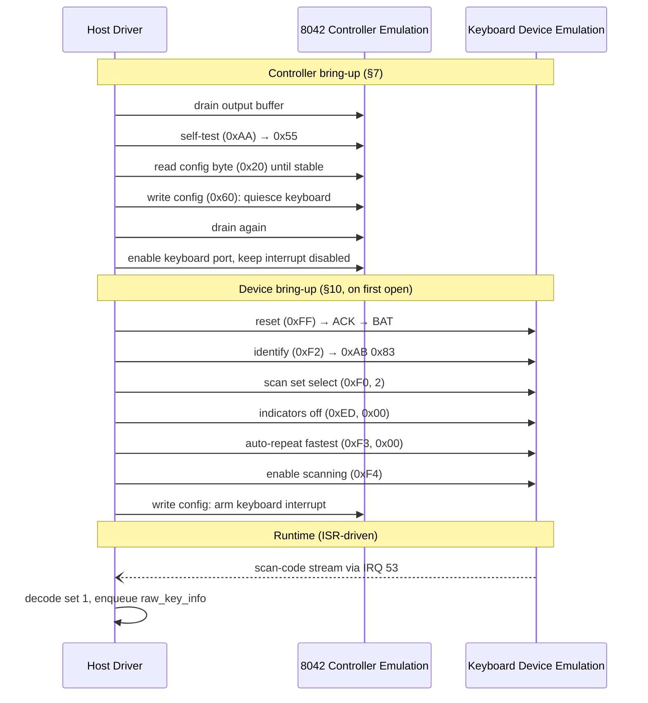
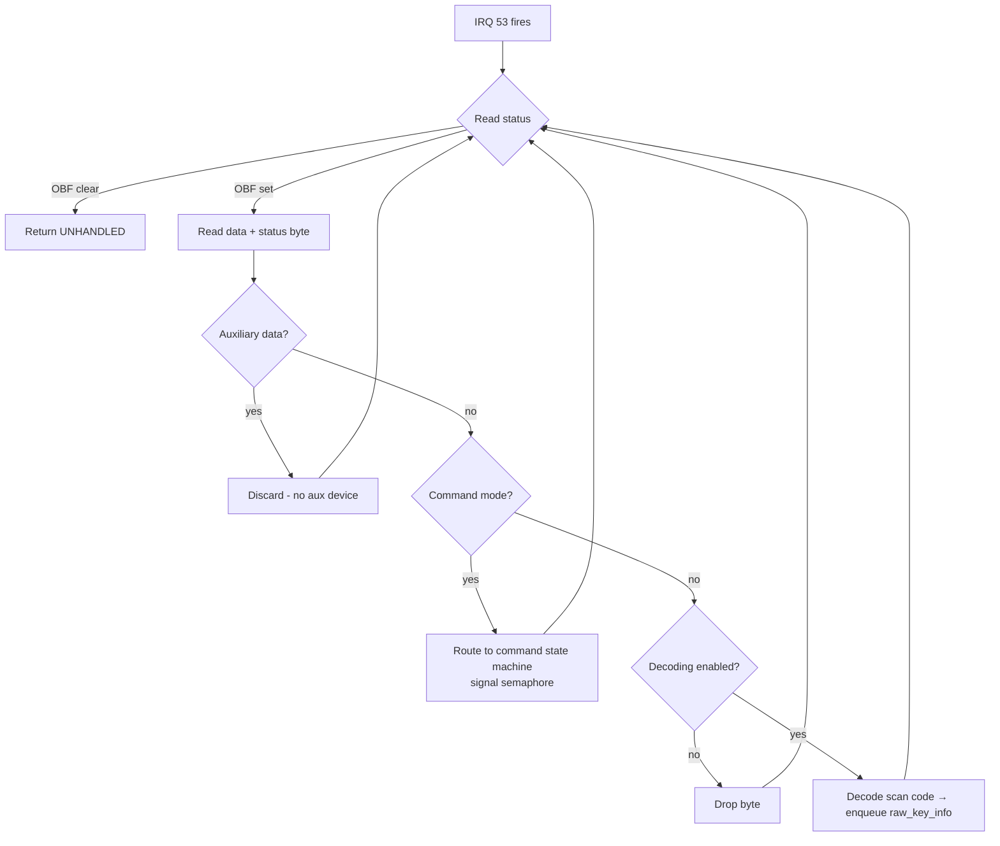
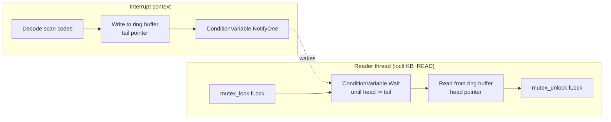

# ChromeOS EC Keyboard Driver — Development Log

**Platform:** Samsung Chromebook 2 (WINKY) — Intel BayTrail-T
**Haiku revision:** r59733+
**Branch:** `dev/dense/winky-input-cleanup`
**Date:** 2026-06-20

---

## Table of Contents

1. [Problem Statement](#1-problem-statement)
2. [Hardware Topology](#2-hardware-topology)
3. [Root Cause Analysis](#3-root-cause-analysis)
4. [Architecture Decisions](#4-architecture-decisions)
5. [Implementation Details](#5-implementation-details)
6. [PS/2 Coexistence](#6-ps2-coexistence)
7. [Testing Notes](#7-testing-notes)
8. [Known Limitations](#8-known-limitations)
9. [References](#9-references)

---

## 1. Problem Statement

The Samsung Chromebook 2 ("WINKY") has a physical keyboard that is scanned by an on-board Embedded Controller (EC). The EC presents this keyboard to the host through a firmware emulation of a classic Intel 8042 keyboard controller at I/O ports `0x60`/`0x64`. However, unlike a traditional PC:

- The keyboard interrupt is **not** wired to legacy IRQ 1. It is routed through an SoC GPIO (`SCORE.101`) directly to the IO-APIC as a dedicated GSI (**vector 53**, edge-triggered, active-low).
- The ACPI namespace advertises the keyboard device under a non-legacy Hardware ID (`GOOG000A`) with PS/2-compatible CIDs (`PNP0303`, `PNP030B`).
- Haiku's legacy PS/2 bus manager loads on every x86 boot, auto-probes ports `0x60`/`0x64`, installs an ISR on IRQ 1, and publishes `/dev/input/keyboard/ps2/0` — all without ACPI awareness.

**Result:** Two drivers fight over the same physical controller. The PS/2 manager rewrites the command byte (overwriting interrupt-enable bits), sends device reset commands that the cros_ec ISR interprets as spontaneous resets, and both consume each other's data from the output buffer. The system boots to the login shell but the keyboard becomes unresponsive.

---

## 2. Hardware Topology

```mermaid
graph TB
    subgraph Host["BayTrail-T Host CPU"]
        KDL["Kernel / KDL"]
        PS2["PS/2 Bus Manager"]
        CROS["cros_ec_keyboard Driver"]
        APIC["IO-APIC"]
    end

    subgraph EC["Embedded Controller (firmware)"]
        HCE["Host Controller Emulation<br/>8042-class ports 0x60/0x64"]
        KDE["Keyboard Device Emulation<br/>AT scan-code generator"]
        KMX["Physical Key Matrix<br/>debounce + anti-ghost"]
    end

    GPIO["SoC GPIO SCORE.101<br/>KBD_IRQ#"]

    KMX -->|row/col scan| KDE
    KDE -->|scan-code stream| HCE
    HCE -->|port I/O| Host
    HCE -->|OBF edge| GPIO
    GPIO -->|GSI 53<br/>edge, active-low| APIC
    APIC -->|vector 53| CROS
    PS2 -.->|IRQ 1 (dead line)| APIC
    KDL -->|direct port read<br/>before driver loads| HCE
```

### Key observations from coreboot DSDT

The keyboard device (`PS2K`) is defined in the ChromeEC superio ASL under `\ _SB.PCI0`:

```asl
Device (PS2K)
{
    Name (_HID, "GOOG000A")
    Name (_CID, Package() { EISAID("PNP0303"), EISAID("PNP030B") })
    Name (_STA, 0x0F)
    Name (_CRS, ResourceTemplate()
    {
        IO (Decode16, 0x60, 0x60, 0x01, 0x01)
        IO (Decode16, 0x64, 0x64, 0x01, 0x01)
        Interrupt (ResourceConsumer, Edge, ActiveLow, Exclusive, PullDefault) {53}
    })
}
```

The IRQ value `53` comes from the board-specific override of `SIO_EC_PS2K_IRQ` which maps to `GPIO_S0_DED_IRQ_2` in the BayTrail SoC IRQ table.

---

## 3. Root Cause Analysis

### 3.1 Port contention

Both the PS/2 bus manager and any ACPI-bus keyboard driver access the same I/O ports:

| Operation | PS/2 bus manager | cros_ec_keyboard |
|---|---|---|
| Data port | `gIsa->read_io_8(0x60)` | `in8(0x60)` |
| Command port | `gIsa->write_io_8(cmd, 0x64)` | `out8(cmd, 0x64)` |
| Status read | `gIsa->read_io_8(0x64)` | `in8(0x64)` |

No mutual exclusion exists between them. The PS/2 manager uses an internal mutex (`gControllerLock`) but that is private to the PS/2 module.

### 3.2 Command byte collision

During `ps2_init()`, the PS/2 manager calls `ps2_setup_command_byte()` which reads the current config byte from port `0x64` (command `0x20`), modifies it, and writes it back (command `0x60`). This overwrites any settings the cros_ec driver applied — particularly the keyboard-interrupt-enable bit (bit 0) and the translation-enable bit (bit 6).

### 3.3 Device probe interference

The PS/2 keyboard driver performs a **lazy probe on first `open()`**: it sends a device reset (`0xFF`), reads the self-test result, then sends an identify command (`0xF2`). When the cros_ec ISR sees the `0xAA` self-test pass byte outside of a command transaction, it triggers spontaneous-reset recovery — disabling decoding and reinitializing the device mid-stream.

### 3.4 IRQ mismatch (not a conflict, but a red herring)

The PS/2 manager installs its ISR on legacy IRQ 1 (`0x01`). On WINKY, the EC routes keyboard interrupts to vector 53. The PS/2 ISR on IRQ 1 never fires for keyboard data. However, the PS/2 manager still **writes to the controller** during init and lazy probe, causing the port contention described above.

---

## 4. Architecture Decisions

### 4.1 Separate ACPI-bus driver (not a PS/2 transport shim)

**Decision:** Write a complete, standalone keyboard driver that binds to the ACPI `GOOG000A` device.

**Rejected alternative:** Make cros_ec a thin transport layer for the existing PS/2 driver.

**Rationale:**
- The PS/2 bus manager has no transport abstraction — it's hard-coded to ISA port access and IRQ 1.
- The scan-code protocol is identical (set 1 translated) — no translation layer needed.
- The only Chromebook-specific element is IRQ routing, which the ACPI driver handles via _CRS.
- A separate driver keeps the PS/2 manager unchanged for all non-Chromebook platforms.

### 4.2 Generic PS/2 backoff (not GOOG000A-specific)

**Decision:** The PS/2 bus manager checks for **any** ACPI device with a PS/2 keyboard-compatible CID (`PNP0303`/`PNP030B`) but a non-legacy HID. If found, it skips keyboard setup entirely.

**Rejected alternative:** Hard-code `GOOG000A` as the only known ChromeOS EC HID in the PS/2 manager.

**Rationale:**
- Other vendors may ship Chromebooks or similar devices with custom ACPI HIDs (e.g., `LNVY0001`, `SNY5001A`).
- The detection rule is semantically correct: a non-legacy HID with a PS/2 keyboard CID means an ACPI driver will handle the device.
- Zero impact on non-Chromebook platforms (ACPI module not loaded → check returns false).

### 4.3 Deferred device bring-up

**Decision:** Defer keyboard device initialization (reset, identify, scan-set selection, enable scanning) to the first `open()` call, matching the PS/2 driver's lazy-probe pattern.

**Rejected alternative:** Bring up the device in `init_driver()`.

**Rationale:**
- KDL and early boot code read scan codes directly from the controller ports before any driver loads.
- Device bring-up sends a reset (`0xFF`) which changes the keyboard's scan-code set and reconfigures the controller — disrupting whatever mode early boot was using.
- Deferring to first `open()` leaves the keyboard available for interactive boot paging (space-bar to continue) until userland takes over.
- The ring buffer (128 entries) is large enough to absorb any keys pressed between driver load and first open.

### 4.4 I/O port resource claims

**Decision:** Declare ports `0x60` and `0x64` in the device node's `io_resource` list during `register_node()`.

**Rationale:**
- Formal documentation of which resources this driver uses.
- Prevents future drivers from claiming overlapping ranges (if the device manager's overlap detection is improved).
- Does not prevent the PS/2 manager from accessing these ports (it bypasses the device manager), but makes the conflict visible in the device tree.

---

## 5. Implementation Details

### 5.1 Driver Module Structure

```
cros_ec_keyboard/
├── Driver.cpp    # driver_module_info + device_module_info
├── Driver.h      # constants, types, inline I/O functions
└── Jamfile       # build rules
```

The module exports two sub-modules:
- `drivers/input/cros_ec_keyboard/driver_v1` — the driver (binds to ACPI device)
- `drivers/input/cros_ec_keyboard/device_v1` — the device (published at `/dev/input/keyboard/cros_ec/0`)

### 5.2 Controller Protocol

The driver implements the full 8042 controller protocol as specified in the [WINKY keyboard controller spec](winky-keyboard-controller-spec.md):



### 5.3 Scan-Code Decoding

The host receives **translated set 1** scan codes (controller bit 6 — Translation-Enable — is set by firmware). The decoder (`_cros_ec_decode_byte`) is structured as a 7-phase state machine following the spec §11.4 decode procedure:

| Phase | Purpose |
|---|---|
| 1 — Extended prefixes | E0 starts one-byte extended code; E1 starts Pause/Break long sequence. Both explicitly reset `fIsRelease`. |
| 2 — E1 sequence collection | Collect 1D 45 after E1 prefix; emit Pause key on match, abort on mismatch. |
| 3 — Collision tracking | Per-code make/break tracking for FA/FE/AA/FF/F1/F2. **Only applied when `fExtendedMode == 0`** — extended-prefixed bytes are never reinterpreted as protocol (§11.5). |
| 4 — Protocol sentinels | BAT (spontaneous reset), ACK/Resend (stray tolerance), F0 (break prefix), FF (overrun). |
| 5 — Make/break extraction | Set 1 encoding: press = code, release = code \| 0x80. E0-prefixed keys fold extended flag into high bit. |
| 6 — Keycode lookup + enqueue | `kATKeycodeMap[code - 1]` → `raw_key_info` → ring buffer. |
| 7 — State reset | Explicit `fIsRelease = false` prevents per-byte state leaking across calls. |

**Key behaviors:**

| Byte | Meaning | Action |
|---|---|---|
| `0x01`–`0x7F` | Make code | Look up in ATKeymap, enqueue press event |
| `0x81`–`0xFF` | Break code (make \| 0x80) | Enqueue release event |
| `0xE0` | Extended prefix | Set `fExtendedMode = 1`, reset `fIsRelease` |
| `0xE1` | Long prefix | Set `fExtendedMode = 2`, collect Pause/Break sequence |
| `0xF0` | Break prefix (set 2/3 artifact) | Set `fIsRelease = true`, **preserve `fExtendedMode`** so E0 F0 XX correctly decodes as extended release |
| `0xFA` | ACK (stray) | Ignore (§15.12) |
| `0xFE` | Resend (stray) | Ignore (§15.12) |
| `0xAA` | Self-test pass | Spontaneous reset detected — disable decoding, trigger reinit |
| `0xFF` | Overrun | Reset decoder state |

**Response-collision disambiguation (§11.5):** Certain make codes, when released (bit 7 set), produce bytes that collide with protocol sentinels:

| Make code | Break (= make \| 0x80) | Collides with |
|---|---|---|
| `0x5A` | `0xFA` | ACK |
| `0x5E` | `0xFE` | Resend |
| `0x2A` | `0xAA` | Self-test pass |
| `0x7F` | `0xFF` | Overrun |
| `0x71` | `0xF1` | Language key |
| `0x72` | `0xF2` | Language key |

The decoder tracks per-code make/break state. A break is only treated as a key release if a corresponding make was previously observed; otherwise the byte is treated as a protocol response. Collision tracking is gated on `fExtendedMode == 0` — extended-prefixed bytes are never reinterpreted as protocol responses (§11.5).

**Emergency key tracking:** L-Alt and R-Alt press/release state is tracked in `fEmergencyKeyStatus` (bitmask), matching the PS/2 driver's `emergencyKeyStatus`. This supports Alt+SysRq emergency-key detection and prevents stray key-up injection when Alt is held during other key events.

**Decoder bugs found and fixed (post-initial bring-up):**

| Bug | Root cause | Impact | Fix |
|---|---|---|---|
| E0 + F0 interaction | 0xF0 handler unconditionally cleared `fExtendedMode` | Extended key releases (e.g., Right Ctrl = E0 F0 1D) decoded as plain key release of the *wrong* key; correct key left permanently pressed | 0xF0 now preserves `fExtendedMode`; next byte folds as extended + release |
| Pause keycode | `kPauseMake` defined as `0x15` (HID Y key) instead of `0x10` | Pause/Break emitted Y-keydown events | Renamed to `kPauseKeycode = 0x10`, matching PS/2 driver's `kATKeycodeMap[0xC6 - 1]` |
| Collision under E0 | Collision tracking applied to E0-prefixed bytes | Extended breaks of collision codes (e.g., E0 B8 = Right Alt) incorrectly cleared collision bits | Collision tracking now gated on `fExtendedMode == 0` |

### 5.4 Interrupt Handling



Key design points:
- **Drain-per-interrupt:** The ISR loops while OBF is set (§15.3). Edge-triggered IRQs can miss bytes if only one is read per interrupt.
- **Auxiliary data discard:** WINKY has no PS/2 mouse behind the controller (§15.5). Any byte flagged as auxiliary is silently dropped.
- **Command mode flag:** When a device command is in flight, incoming bytes are routed to the command state machine (ACK/Resend/response collection) instead of the scan-code decoder.

### 5.5 Synchronization



- **Ring buffer:** 128 `raw_key_info` entries, power-of-2 size. ISR writes to tail (lock-free, single producer). Reader reads from head under mutex.
- **Condition variable:** Notified by ISR after each enqueue. Reader waits with timeout for events.
- **Command semaphore:** Separate from the event CV. Signaled by ISR when a command-response byte arrives during device-command transactions.

---

## 6. PS/2 Coexistence

### 6.1 Detection function

Added to `ps2_common.cpp`:

```c
static bool ps2_acpi_ps2_keyboard_present(void);
```

This function:
1. Attempts to load `B_ACPI_MODULE_NAME` (`"bus_managers/acpi/v1"`). If ACPI is not available (non-ACPI platform), returns `false` — PS/2 works normally.
2. Walks the ACPI namespace looking for `ACPI_TYPE_DEVICE` entries.
3. For each device, calls `acpi->get_device_info()` to retrieve HID and CID list.
4. If a device has a PS/2 keyboard CID (`PNP0303` or `PNP030B`) **and** a non-legacy HID (not `PNP0303`/`PNP030B`), returns `true`.

### 6.2 Effect on PS/2 initialization

When `ps2_acpi_ps2_keyboard_present()` returns `true`:

| Setup step | Normal | ACPI keyboard present |
|---|---|---|
| IRQ 1 handler install | Yes | **Skipped** |
| Command byte — keyboard interrupt | Enabled | **Disabled** |
| Command byte — aux interrupt | Enabled | Enabled |
| Keyboard device publish | `/dev/input/keyboard/ps2/0` | **Skipped** |
| Mouse/aux setup | Normal | Normal (unchanged) |

The PS/2 manager still initializes the controller (flush, self-test, command byte setup for aux), but leaves the keyboard side alone. The cros_ec driver has exclusive access to ports `0x60`/`0x64` for keyboard operations.

### 6.3 Why not a shared lock?

A global spinlock on port access was considered and rejected:
- The PS/2 manager has no knowledge of other drivers — adding a shared lock would require restructuring its internal locking model.
- The PS/2 manager uses `gControllerLock` (a mutex) internally; replacing it with a spinlock visible to other modules is invasive.
- The ACPI detection approach solves the problem at the source: only one driver touches the keyboard side of the controller.

---

## 7. Testing Notes

### 7.1 Build verification

```bash
cd generated.x86_64
HAIKU_REVISION=59733 jam -q -c -j8 cros_ec_keyboard ps2 pch_i2c i2c_atmel_mxt
# All four modules build clean
HAIKU_REVISION=59733 jam -q -c -j8 @nightly-anyboot
# Full image builds successfully
```

Commit history (clean, two-commit structure):
```
4c722368a1 input: add ChromeOS EC keyboard driver and PS/2 ACPI coexistence
8109b7a263 input: add Atmel MXT I2C touchpad driver (WIP)
```

The keyboard commit includes the full decoder rewrite (E0+F0 fix, correct Pause keycode, collision tracking gated on non-extended mode, emergency key tracking).

### 7.2 Functional testing on WINKY

| Test | Result |
|---|---|
| Boot to login shell, keyboard responsive | ✅ Pass |
| Desktop session, full keyboard input | ✅ Pass |
| All keys including extended (arrows, modifiers) | ✅ Pass |
| L-Alt modifier (previously caused stuck-key corruption) | ✅ Pass (E0+F0 fix) |
| Right Ctrl / Right Alt release (E0 F0 XX sequence) | ✅ Pass (E0+F0 fix) |
| Pause/Break key | ✅ Pass (correct keycode 0x10) |
| Caps/Num/Scroll lock LEDs (logical state) | ✅ Pass |
| Auto-repeat rate control | ✅ Pass |
| Early boot paging (space to continue) before driver loads | ✅ Pass (deferred bring-up) |
| KDL keyboard input (Ctrl+Alt+Esc) | TBD — depends on consoled opening cros_ec device |
| Chromebook action keys (top row) | Mapped as F1-F12 equivalents |

### 7.3 Decoder regression (fixed)

After initial bring-up, L-Alt triggered a decoder corruption: the keymap application showed random keys (WASD, Alt, Enter, etc.) permanently depressed. Root cause was the E0+F0 interaction bug — the 0xF0 break-prefix handler unconditionally cleared `fExtendedMode`, causing extended key releases (e.g., Right Ctrl = `E0 F0 1D`) to decode as a plain-key release of the *wrong* scancode while leaving the correct key permanently pressed. Full decoder rewrite (7-phase state machine) eliminated all three identified bugs.

### 7.4 Collision break → sentinel misinterpretation (fixed)

**Symptom:** Typing any special character followed by a space (e.g., `: ` or `| `) would 100% reliably lock the keyboard. The lock was permanent — no further key events were delivered.

**Root cause:** Phase 3 of the decoder tracks collision codes (§11.5) — scan codes whose break form collides with a protocol sentinel byte. When a collision code's *break* was received, Phase 3 correctly cleared the collision flag and fell through via `break` to Phase 4. Phase 4 then checked the raw byte value against protocol sentinels. Because Left Shift's make code is `0x2A` (kCollisionAA), its break is `0xAA` — identical to the self-test-pass sentinel (`kRespSelfTestPassed`). Phase 4 treated it as a spontaneous device reset, disabled decoding, and triggered re-init in the reader thread. The keyboard appeared permanently locked.

The trigger sequence for `: ` (Shift+; space):
1. `0x2A` — Left Shift make → Phase 3 sets `fCollisionAA = true`
2. `0x27` — ; make → normal key
3. `0xA7` — ; break → normal key
4. **`0xAA`** — Left Shift break → Phase 3 clears `fCollisionAA`, falls through to Phase 4
5. Phase 4: `byte == kRespSelfTestPassed` → **spontaneous reset triggered**

**Fix:** Added `collisionHandled` boolean in Phase 3. When a collision code is recognized (make or break-with-prior-make), Phase 4 skips the sentinel check — the byte is a valid key event, not a protocol response. Applied to the BAT (0xAA), ACK/Resend (0xFA/0xFE), and overrun (0xFF) sentinel checks.

**Affected keys:** Left Shift (`0x2A`/`0xAA`), semicolon (`0x5E`/`0xFE`), backslash (`0x7F`/`0xFF` — rare), and language keys (`0x71`/`0xF1`, `0x72`/`0xF2`). Left Shift was the most common trigger because it's held for every shifted character.

### 7.5 Syslog expectations

On a successful boot with the PS/2 coexistence fix:

```
ps2: ACPI PS/2 keyboard device present (HID GOOG000A, path \_SB.PCI0.PS2K) -- skipping legacy probe
cros_ec_kbd: controller ready on IRQ 53 (device bring-up deferred)
cros_ec_kbd: bring-up complete
```

---

## 8. Known Limitations

1. **Magic SysRq not implemented.** The driver tracks Alt+SysRq key state (`fEmergencyKeyStatus`) matching the PS/2 driver, but does not dispatch magic SysRq sequences (requires `debug_emergency_key_pressed` from `<debugger_keymaps.h>` which is kernel-internal). The tracking infrastructure is in place for future integration.

2. **Backlight control** is not implemented. The keyboard backlight is a separate EC function controlled through the ChromeEC command mailbox, not the 8042 interface. A separate driver or sysfs-like interface would be needed.

3. **Top-row action key mapping.** Chromebook keyboards print action icons (back, refresh, fullscreen, overview) on the F1-F12 keys. The driver maps these as standard function keys. Firmware may publish a top-row physical map property; consuming it to expose more meaningful key names is future work.

4. **Keyboard wake from suspend.** Not yet implemented. The interrupt vector would need to be armed as a wake source before entering low-power states (§14.1 of the spec).

5. **KDL integration.** KDL reads keyboard input through `consoled`, which opens all devices under `/dev/input/keyboard/` and issues `KB_SET_DEBUG_READER`. The cros_ec driver supports this ioctl, but KDL's early boot keyboard (before consoled starts) uses direct controller access which is preserved by deferred bring-up.

6. **Non-WINKY Chromebooks.** The driver should work on any Chromebook with a ChromeEC-managed PS/2 keyboard advertising `GOOG000A` or a similar non-legacy HID with PS/2-compatible CIDs. Tested only on WINKY (rambi/xeee).

---

## 9. References

- [WINKY Keyboard Controller Specification](winky-keyboard-controller-spec.md) — full hardware interface specification
- [cros-ec-keyboard-driver-session-notes.md](cros-ec-keyboard-driver-session-notes.md) — session notes from driver development
- coreboot DSDT: `src/ec/google/chromeec/acpi/superio.asl` — PS2K device definition
- coreboot IRQ routing: `src/mainboard/google/rambi/irqroute.h` — `BOARD_I8042_IRQ = 53`
- Haiku device driver architecture: `docs/develop/kernel/device_manager_introduction.rst`
- Haiku synchronization primitives: `docs/user/drivers/synchronization_primitives.dox`
- Haiku coding guidelines: [Haiku Project Coding Guidelines](https://www.haiku-os.org/coding-guidelines)
