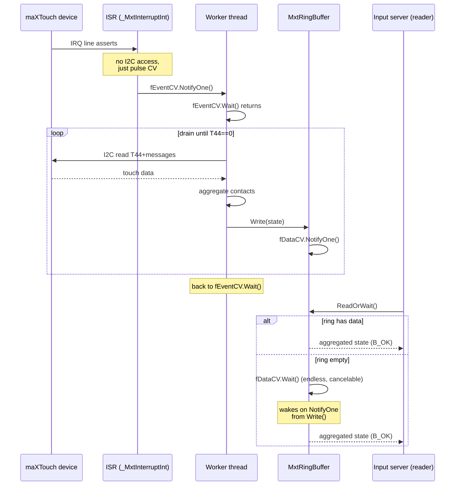

# Atmel maXTouch Touchpad — Interrupt-Driven Driver Development Log

## Table of Contents

1. [Problem Statement](#1-problem-statement)
2. [Hardware Topology](#2-hardware-topology)
3. [Architecture: Three-Layer Event Model](#3-architecture-three-layer-event-model)
4. [Buffer Synchronization: From Double Buffer to SPSC Ring](#4-buffer-synchronization-from-double-buffer-to-spsc-ring)
5. [The Open-Cookie Bug](#5-the-open-cookie-bug)
6. [Implementation Details](#6-implementation-details)
7. [Synchronization Primitives](#7-synchronization-primitives)
8. [Testing Notes](#8-testing-notes)
9. [Known Limitations](#9-known-limitations)
10. [Event Processing Refinement](#10-event-processing-refinement)
    - 10.1 Double-Averaging Problem
    - 10.2 Ring Buffer as Event Stream
    - 10.3 Orientation Transform Bug
    - 10.4 Stanza-Aware Event Protocol
    - 10.5 Worker Thread Refinements
    - 10.6 T7 Config Write Failure — Silent Failure Discovery
11. [V2 Vision: Virtualized Touch Engine](#11-v2-vision-virtualized-touch-engine)
12. [References](#12-references)

---

## 1. Problem Statement

The baseline polling driver (commit `8109b7a`) worked but burned CPU: the input server's RT thread polled T44 every 1ms in a tight loop, even during idle. The device on WINKY (Samsung Chromebook 2, BayTrail) supports level-triggered IRQ via ACPI `_CRS`. The goal was an interrupt-driven architecture that is **acquiescent under zero activity** and **responsive under load**.

Requirements:
- **P0**: Buffer safely accessible by reader and writer concurrently
- **P1**: Writer fills the buffer continuously between reads (no dropped events)
- **P2**: Writer continues processing ISRs while the reader drains (opportunistic concurrency)
- **Idle coalescing**: Both threads sleep when nothing to do — input server blocks on read, worker blocks on ISR

---

## 2. Hardware Topology

```
+------------------+     IRQ (level-triggered, active-low)     +----------+
|  Atmel maXTouch  | ----------------------------------------> |  IO-APIC |
|  (I2C 0x4B)      |                                          +-----+----+
|                  |              I2C bus                            |
+------------------+ <---------------------------------------------+
        ^                                                   |
        | I2C read/write                                    | IRQ handler
        |                                                    |
+-------+--------+                                  +--------v--------+
|  DesignWare    |                                  |  BayTrail CPU   |
|  I2C controller|                                  |  (Atom Z3735)   |
+----------------+                                  +-----------------+
```

The maXTouch asserts the IRQ line while messages are queued in its internal circular buffer. Reading T44 (message count) returns 0 when the queue is empty, at which point the device deasserts the line. This level-triggered semantics means: **drain until T44==0, then sleep**.

---

## 3. Architecture: Three-Layer Event Model



**Key design decisions:**

- **ISR does nothing but pulse**: No I2C bus access in interrupt context. The DesignWare I2C controller is shared; holding it during ISR would deadlock other I2C devices.
- **Worker is the I2C pump**: Wakes on ISR pulse, drains all pending T44 cycles, writes aggregated states to the ring. Goes back to sleep when queue empties.
- **Reader is a dumb blocker**: Input server calls `MS_READ_TOUCHPAD`, which blocks on the ring buffer CV until data arrives. No polling, no busy-waiting.

---

## 4. Buffer Synchronization: From Double Buffer to SPSC Ring

### 4.1 Double Buffer (abandoned)

The initial approach used two ring buffers with a ping-pong swap protocol:

```
Worker writes to ring A → TrySwap() → Reader drains ring A
Worker writes to ring B → TrySwap() → Reader drains ring B
```

**Problems found:**
- `TrySwap()` unconditionally signaled the reader even when the ring was empty, causing phantom events
- Metadata race: reader held a raw pointer into a ring while the worker reset `writePos`/`count` on the same ring after swap
- Two semaphores, two rings, index-flip logic — hard to reason about, hard to verify

### 4.2 SPSC Ring Buffer (final)

Replaced with a single ring buffer using `MutexLocker` for data protection and an independent `ConditionVariable` for notification:

```cpp
class MxtRingBuffer {
    mxt_touch_state fSamples[16];
    int32           fReadPos, fWritePos;
    mutex           fMutex;          // protects sample copy
    ConditionVariable fDataCV;       // notification only (own internal lock)
};
```

**Write()** — MutexLocker protects buffer + positions. NotifyOne on every write.

**Read()** — MutexLocker protects drain. Non-blocking: returns `B_TIMED_OUT` if empty.

**ReadOrWait()** — No mutex of its own. Calls `Read()`; if empty, calls `fDataCV.Wait()` (endless, cancelable, uses CV's own internal lock); retries `Read()`.

```mermaid
graph LR
    subgraph Writer "Worker thread"
        A[Drain I2C] --> B[Aggregate contacts]
        B --> C[Write state]
        C --> D[NotifyOne CV]
    end

    subgraph Reader "Input server thread"
        E[ReadOrWait] --> F{Read}
        F -->|data| G[Drain + average]
        F -->|empty| H[CV.Wait endless]
        H --> F
        G --> I[Return touchpad_movement]
    end

    D -. "pulse" -. H
```

**Why this works:**
- MutexLocker protects all shared-state mutation (sample copy, position advance)
- CV uses its own internal spinlock — independent of the data mutex
- NotifyOne fires on every write; reader misses one pulse, catches the next
- ReadOrWait loop: try read → if empty, wait → retry. The wait is endless and cancelable (thread interruption).

---

## 5. The Open-Cookie Bug

### 5.1 Symptom

The driver completed one successful read of 15 accumulated events, then the reader blocked forever on the second `MS_READ_TOUCHPAD`. Worker continued processing interrupts normally. Ring buffer traces showed `Write` notifying the CV, but `ReadOrWait` never woke.

### 5.2 Root Cause

The device `open()` hook copied the entire `MxtDevice`:

```cpp
// BROKEN — creates a second ring buffer with its own CV
MxtDevice* devCookie = new MxtDevice(*device);
```

This produced **two** `MxtRingBuffer` instances:
- Original device's ring → worker writes here, notifies original CV
- Copy's ring → reader opens on this, waits on copy's CV (never notified)

The first read drained 15 events that happened to be in the copy's ring from the copy constructor. The second read blocked on an empty ring whose CV received zero notifications.

### 5.3 Fix

Adopted the `cros_ec_keyboard` pattern: lightweight `open_cookie` holding a pointer to the shared device:

```cpp
struct mxt_open_cookie {
    MxtDevice* fDevice;
};

// open() creates the cookie, not a copy
mxt_open_cookie* c = new mxt_open_cookie();
c->fDevice = device;
device->Open(flags);  // increment shared open count
*_cookie = c;
```

All opens share one `MxtDevice`, one ring buffer, one CV. Worker and reader operate on the same data structure.

---

## 6. Implementation Details

### 6.1 Driver Module Structure

Two modules: `driver_v1` (I2C bus manager interface) and `device_v1` (published device node). Dependencies on `B_DEVICE_MANAGER` and `B_ACPI`.

### 6.2 Device Initialization Sequence

1. Walk ACPI `_CRS` → discover IRQ number, trigger/polarity flags
2. Read info block (family ID, variant, version)
3. Parse object table (T5/T6/T7/T9/T18/T44/T100 addresses)
4. Drain stale boot messages
5. Read touch resolution from T9/T100 range registers
6. Soft reset via T6 command
7. Drain post-reset messages
8. Write essential config (T7 power, T9 control, T18 interrupt behavior)
9. Configure IO-APIC for IRQ GSI
10. Install interrupt handler
11. Spawn worker thread

### 6.3 Message Queue Drain

Per OBP spec §9.4, T44 sits immediately before T5. A single I2C burst from T44 returns the count byte plus the first message. Remaining messages are read via auto-incrementing pointer reads.

Each drain cycle aggregates all contacts into one `mxt_touch_state` (centroid X/Y, average pressure, max finger count, any button). Orientation transform applied per spec §11.1.

### 6.4 Worker Thread Lifecycle

```
spawn → fEventCV.Wait() → ISR wakes → drain loop → fEventCV.Wait() → ...
                                                              ↑              |
                                                              +--------------+
```

The inner drain loop breaks on `B_BAD_DATA` (T44 count == 0, queue empty) or I2C error. Each drain cycle's aggregated state is written to the ring buffer with **stanza-aware protocol**: contact data always streamed, one zero-contact event on touch→no-touch transition (gesture-end signal for input server), redundant zeros suppressed during idle. No artificial snooze between cycles — I2C transactions run at controller speed.

---

## 7. Synchronization Primitives

| Primitive | Header | Purpose |
|-----------|--------|---------|
| `ConditionVariable fEventCV` | `<condition_variable.h>` | ISR → worker notification. `NotifyOne()` from ISR context, `Wait()` in worker thread. |
| `mutex fMutex` | `<lock.h>` | Protects ring buffer sample array and positions. |
| `MutexLocker` | `<util/AutoLock.h>` | RAII wrapper for mutex. Lock/unlock on scope entry/exit. |
| `ConditionVariable fDataCV` | `<condition_variable.h>` | Worker → reader notification. Independent internal spinlock. |

**Critical rule**: `fDataCV.Wait()` is called **without** passing `fMutex`. The CV manages its own waiter list with an internal spinlock. The mutex only protects the shared buffer during copy operations.

---

## 8. Testing Notes

### 8.1 Build verification

```bash
cd generated.x86_64
HAIKU_REVISION=59733 jam -q -c -j8 @nightly-anyboot
```

Driver compiles as `objects/haiku/x86_64/release/add-ons/kernel/drivers/input/i2c_atmel_mxt/i2c_atmel_mxt`. Full image produces a bootable ISO.

### 8.2 Functional testing on WINKY

- Touchpad responds to single-finger movement
- Clickpad button detected via T19 GPIO messages
- Driver is acquiescent under idle (no I2C traffic, worker sleeps on CV)
- Multiple rapid touches produce smooth cursor movement (ring buffer absorbs bursts)

### 8.3 Debug trace evolution

Diagnostic `TRACE` calls were added during development to the ISR, worker drain loop, ring buffer Write/Read/ReadOrWait, and reader Control path. All stripped from hot paths in final code; only `ERROR`-level traces remain for I2C failures.

---

## 9. Known Limitations

- **Single device**: No support for multiple maXTouch controllers
- **T100 partial**: T100 auxiliary data (area, amplitude) parsed but not fully utilized
- **No absolute mode**: Driver reports relative-like centroid; multi-finger gestures reduced to single-point + finger count
- **Firmware config dependency**: Relies on ChromeOS UEFI firmware to program device registers; skips config download
- **Missed clicks**: T19 GPIO state is change-only; no persistent button state across drain cycles
- **No two-finger right-click**: No gesture engine — driver only accumulates raw contact data

---

## 10. Event Processing Refinement

After the initial interrupt-driven driver was working (enumeration, cursor movement, clickpad button), several event processing issues were discovered on WINKY during real-world testing.

### 10.1 Double-Averaging Problem

**Symptom:** Slow, laggy, "ghosty" cursor movement — cursor trailed behind the finger and jerked under acceleration.

**Root cause:** The ring buffer `Read()` drained ALL accumulated samples and averaged their X/Y positions temporally. This created **ghost positions** — artificial points the finger never actually occupied. The input server then computed deltas from these ghost points, producing jerky movement.

The input server already applies its own smoothing pipeline:
- Small-movement dampening (halves sub-threshold deltas)
- Delta accumulation with fractional remainder tracking (low-pass filter)
- Two-layer acceleration curve with `translation=12.0` divisor

The driver's temporal averaging compounded with the server's smoothing, creating excessive lag. The `i2c_elan` driver (the other I2C touchpad in Haiku) streams events directly with **zero** temporal averaging.

**Fix:** Changed `Read()` to return a single sample — no averaging. The ring buffer is an **event pipe**, not an accumulator.

### 10.2 Ring Buffer as Event Stream

The input server calls `MS_READ_TOUCHPAD` via ioctl exactly **once per 8ms poll cycle** (125 Hz). Each call gets one `touchpad_movement`. The ring buffer bridges the rate mismatch: the device generates events at ~100-200 Hz (T7 power config), the input server consumes at 125 Hz.

**Hybrid read strategy:**
- **Single sample in ring** (slow movement, 1:1 flow): return oldest — FIFO preserves smooth trajectory
- **Multiple samples** (fast swipe, backlog): return latest — cursor stays responsive, no spatial jump

The input server's delta accumulation and fractional remainder tracking handle the gap between samples.

### 10.3 Orientation Transform Bug

**Symptom:** Left/right movement mirrored on the touchpad.

**Root cause:** An extra X-flip was introduced during screen-space conversion. The device reports X=0 at screen left (correct), only Y needs flipping (device Y=0 is at the hinge/screen bottom).

**Fix:** Removed unconditional X-flip; only Y flipped after orientation transform.

### 10.4 Stanza-Aware Event Protocol

**Symptom A (no zero events):** Cursor jumped to top-left corner on next touch after finger lift. The input server's `TouchpadMovement` state machine (`fMovementStarted`, `fPreviousX/Y`) was never reset — stale position caused huge delta on next touch.

**Symptom B (too many zeros):** Spurious double-clicks. Flooding the ring with zero-contact events confused the tap gesture logic — each zero triggered `_NoTouchToMovement`, then next touch re-fired tap detection.

**Fix:** Track **touch stanzas** (contact phases) in the worker thread:

```
touch → touch → touch → lift(write ONE zero) → [block, CPU idle] → next touch
```

- Contact data always streamed to ring
- Touch → no-touch transition: write one zero-contact event (gesture-end signal)
- Already outside stanza: skip redundant zeros (no flood)
- Idle: worker blocks on CV, reader blocks on ring CV (CPU-efficient)

This gives the input server its gesture-end reset signal without flooding the tap logic.

### 10.5 Worker Thread Refinements

- **Removed `snooze(1000)`** between drain cycles — unnecessary 1ms delay. The device either has data or doesn't; I2C transactions run at controller speed.
- **T9 Ctrl=0x83** matches Windows reference driver (crostouchpad4-atmel). ActiveTouches=1; multi-finger detection comes from multiple T9 messages per drain cycle, not the ActiveTouches field.

---

## 10.6 T7 Config Write Failure — Silent Failure Discovery

**Symptom:** Driver initialized successfully but touchpad was non-functional (no cursor movement, no clicks). No errors in logs — all writes appeared to succeed.

**Root cause:** The driver wrote to T7 (Power Config), T9 Ctrl, and T18 Ctrl registers without **read-back verification**. `_ExecCommand(I2C_OP_WRITE_STOP)` returned B_OK for every write, but the device retained firmware defaults because the PCH I2C controller on BayTrail uses a `busy` flag that must be cleared by a STOP_DET interrupt. Writes without proper STOP handling silently failed — the controller accepted the transaction but never committed to the device.

**Investigation:** Initial attempts used a two-phase write protocol (set pointer → write data, no STOP between phases) with an `I2cBusGuard` holding the bus across both phases. This deadlocked the PCH controller: Phase 1 sent no STOP, so `bus->busy` never cleared, so Phase 2's `atomic_test_and_set(&bus->busy, 1, 0)` failed immediately with B_BUSY. The retry loop in `_WriteT7WithVerify` kept hitting B_BUSY because the first phase had already stuck the controller.

**Fix:** Reverted to bundled writes — addr + data in one transaction with STOP, matching what the original blind writes used. Added `_WriteObjectVerify()` helper that performs the bundled write, then reads back and verifies the value matches. This catches silent failures that were previously undetectable.

All three config registers (T7, T9 Ctrl, T18 Ctrl) now use `_WriteObjectVerify` with mandatory read-back. T9 Ctrl=0x83 and T18 Ctrl=0x00 may also have been silently failing before — they are now verified too.

**Key learning:** I2C write success (B_OK return) does not guarantee the value stuck on the device. Read-back verification is mandatory for any register write where the default could differ from the desired value.

---

## 11. V2 Vision: Virtualized Touch Engine

The current driver (V1) projects raw drain-cycle aggregates through a ring buffer event pipe to the input server. Movement is now smooth as butter (T7 config writes verified), but two critical gaps remain: **missed clicks** and **no two-finger right-click detection**. The V2 touch engine addresses both.

### 11.1 Motivation

V1 works for cursor movement because the ring buffer event pipe correctly bridges the ~50 Hz device rate to the 125 Hz input server poll rate. But V1 has two architectural gaps:

1. **Missed clicks:** T19 GPIO messages are change-only — they only fire when the physical button state changes. In a drain cycle where no T19 message arrives (press happened between cycles), `state.button` is zero and the click vanishes. V1 has no persistent button state tracking across cycles.

2. **No two-finger right-click:** V1 only accumulates raw contact data into `mxt_touch_state`. It never interprets gestures — no two-finger tap detection, no scroll-from-contact-data. The input server's heuristic gesture detection (`movement_maker.cpp`) is insufficient for reliable multi-finger gestures on this hardware.

The SDHCI/MMC bus driver (`src/add-ons/kernel/bus_managers/sdhci/`) uses a **VirtualControllerState** cache: the worker thread maintains a coherent, virtualized view of the controller's state, and the rest of the system interacts with that abstraction rather than raw hardware registers. This pattern decouples messy hardware timing from clean software interfaces.

### 11.2 Architecture

```
maXTouch device (~50 Hz per-contact messages)
    ↓
Worker thread: Touch Engine (stateful)
    ├── Contact table (report ID → x, y, pressure, type, lift status)
    ├── Persistent button state (last known T19 GPIO value)
    ├── Gesture state machine (move, tap, two-finger-tap, scroll, lift)
    ├── Rate limiter (125 Hz output to match input server poll rate)
    └── Well-formed event generator
        ↓
Ring buffer (event pipe)
    ↓
Input server (naive consumer, one event per 8ms poll)
```

### 11.3 Touch Engine Responsibilities

**Contact tracking:** Parse each T9/T100 message into a contact table keyed by report ID. Track individual finger positions, detect new/lost contacts across cycles. This is data the input server never sees but that enables proper gesture classification.

**Persistent button state:** Remember the last known T19 GPIO value and carry it forward until a new T19 message updates it. This eliminates missed clicks when T19 messages don't arrive in every drain cycle.

```cpp
// V2 engine: persistent button state
class TouchEngine {
    uint8 fLastButtonGpio;     // last known T19 GPIO register value
    bool  fButtonPressed();    // !(fLastButtonGpio & 0x01) — active-low

    void OnT19Message(uint8 gpioState) {
        fLastButtonGpio = gpioState;
    }

    // If no T19 message arrived this cycle, button state persists.
};
```

**Gesture classification:** Distinguish tap vs. move vs. lift vs. two-finger-tap in-kernel, where we have full per-contact data. Currently the input server infers gestures from sparse `touchpad_movement` events — it has to guess from zPressure thresholds and finger width heuristics. The engine would know for sure.

**Two-finger right-click detection:** When two contacts are detected simultaneously (same drain cycle, both with DETECT flag), emit a touchpad_movement with the right-button bit set. This requires tracking contact coexistence, not just centroid averaging.

**Scroll detection:** Two-finger scroll and edge scroll detected in-kernel based on raw contact data, not centroid position. Currently the input server's `TouchpadMovement::_CheckScrollingToMovement` uses position-based heuristics (edge zones, finger count from bitmask). The engine could detect scroll gestures from actual two-finger trajectories and emit clean wheel events.

**Rate limiting:** Output events at 125 Hz to match the input server's poll rate. When the device generates faster, the engine picks the best representative event for each output slot — latest position for responsiveness, with proper gesture boundaries preserved.

**Well-formed output:** Each event is a complete, self-contained `touchpad_movement` that requires zero interpretation from the input server. Gesture boundaries explicit (touch start, movement, lift). Position always valid (no ghost averages). Finger count accurate (from contact table, not ring sample count).

### 11.4 Read Interface

The ring buffer's `Read()` becomes trivial: return one well-crafted event, advance pointer. The engine ensures every event in the ring is correct — no hybrid read logic needed. The input server sees a clean, consistent stream.

```cpp
// V2 Read() — simple FIFO, engine guarantees correctness
status_t MxtRingBuffer::Read(mxt_touch_state& state)
{
    MutexLocker lock(&fMutex);
    if (fReadPos == fWritePos)
        return B_TIMED_OUT;
    state = fSamples[fReadPos];
    fReadPos = (fReadPos + 1) % MXT_RING_CAPACITY;
    return B_OK;
}
```

### 11.5 When to Build

The V1 driver is **fully functional for cursor movement** — smooth, responsive, no lag. But it has two critical gaps: missed single-finger clicks (no persistent button state) and no two-finger right-click (no gesture engine). The V2 engine addresses both in one pass.

Priority: after current platform bring-up tasks are complete. The V1 architecture (ISR pulse → worker drain → ring buffer → blocking reader) remains sound; the touch engine is an enhancement within the worker thread, not an architectural change.

## 13. V2 Touch Engine — Implementation Notes

### 13.1 WINKY Device Quirks (not in OBP spec)

These behaviors were discovered through diagnostic logging on the BayTrail Samsung Chromebook 2 (WINKY) and are **not documented in the Atmel maXTouch OBP specification**.

**T9 PRESS flag never set.** Every T9 touch message from WINKY has bit 6 (PRESS) clear, including the first message for a new contact. The hardware simply does not set this flag. Press must be inferred from state transition: a contact is "new" if its table slot was not active before the message arrived (`bool isNew = !contact->active`). This matches the T100 approach, which has no explicit PRESS flag at all.

**T9 RELEASE only appears with detect=0.** The RELEASE flag (bit 5) is only set in messages where detect=0 (bit 7 clear). These messages are skipped by the parser (they carry no valid position data). Therefore, lift must be detected by **contact absence** — an active contact that receives no message this drain cycle has just lifted. The Flush() cycle marks such contacts as `release=true` before running two-finger tap detection.

**T19 GPIO button on bit 5, not bit 0.** The T19 GPIO state byte reports the clickpad button on bit 5 (mask `0x20`), not bit 0 as assumed from the spec's "each button bit" language. Observed values: `0x00` = pressed (bit 5 clear, active-low), `0x20` = released (bit 5 set). T19 messages are change-triggered: the device sends `0x00` on press and `0x20` on release. The engine carries the last known GPIO value forward across drain cycles so clicks are never missed when T19 messages don't arrive in every cycle.

### 13.2 Contact Lifecycle

```
Touch down → T9 message (detect=1) → _ParseT9Contact:
  isNew = !contact->active → true
  initialX/Y = current position, deltaX/Y = 0
  press = true, active = true

Move (subsequent cycles) → T9 messages continue:
  isNew = false (already active)
  press = true (set unconditionally for every parsed message)
  position updated, delta tracked from initial

Lift → device stops sending messages for this contact:
  No parser runs → press stays false (from previous Flush cleanup)
  Flush: active && !press → release = true
  _DetectTwoFingerTap checks for exactly 2 released contacts with small delta
  If not matched: cleanup deactivates contact, resets flags
```

### 13.3 Bug: Contact Expiry on Cycle 2

The original `_ParseT9Contact` only set `contact->press = true` inside the `if (isNew)` block. On cycle 2+, an existing contact still receiving messages got `press=false` (from previous Flush cleanup), which meant Flush() marked it as lifted and expired it immediately. **Fix:** set `press = true` unconditionally for every parsed message — it now means "received a message this cycle" rather than "hardware PRESS flag was set."

### 13.4 Files

- `TouchEngine.h` — Contact state struct, TouchEngine class declaration
- `TouchEngine.cpp` — Message parsing, contact tracking, gesture detection, Flush aggregation
- `MxtDevice.cpp` — Engine allocation in Initialize() Phase 6b, _DrainAndAggregate routing, _StateToMovement button/finger mapping

---

### 13.5 Device-Manager Registration Hardening

The first Winky boot that reached I2C child registration faulted in `strcmp`
under `device_node::_RegisterPath()`. KDL showed `RDI = 0`, proving that a
driver support callback passed a null attribute string as the first comparison
argument. Haiku's `get_attr_string()` returns `B_OK` when a string attribute
exists with a null value, so checking status alone is insufficient.

`i2c_atmel_mxt_support()` now initializes the bus pointer and requires both
`B_OK` and a non-null value before comparing it with `"i2c"`. Stock
`i2c_elan` remains in the image: the KDL frame did not identify Elan as the
faulting callback, and HID/CID matching allows Atmel and Elan devices to
coexist without an ownership protocol.

An early defensive experiment replaced Haiku's I2C manager with a guarded copy
that omitted absent HID/CID strings. That wrapper had no demonstrated
performance or ordering benefit, and the earlier in-tree driver had already
worked with the stock manager. The missing immediate caller below `strcmp`
also prevented attributing the fault to I2C child construction.

The wrapper was therefore removed. Winky uses Haiku's stock I2C manager while
the Atmel and ChromeOS EC support callbacks retain their justified null checks.
The previously validated image proved that `i2c_atmel_mxt`, stock `i2c_elan`,
and the ChromeOS EC keyboard can coexist; the stock-manager package update
requires its own live validation.

## 12. References

- [Atmel maXTouch OBP Specification](atmel-maxtouch-trackpad-spec.md) — device protocol reference
- [ChromeOS EC Keyboard Driver Log](cros-ec-keyboard-driver-development-log.md) — open_cookie pattern, IRQ discovery
- [Haiku Synchronization Primitives](The Haiku Book_ Synchronization primitives.html) — ConditionVariable, mutex semantics
- [SDHCI embedded driver architecture](../design/sdhci_embedded.md) — the meow-bus worker, pure convergence policy, and container-of-1 controller
- `src/add-ons/kernel/drivers/input/cros_ec_keyboard/` — ring buffer + CV pattern, ACPI _CRS walk
- `src/add-ons/kernel/drivers/input/i2c_elan/` — touchpad device module structure (no temporal averaging)
- `src/add-ons/kernel/busses/i2c/pch/pch_i2c.cpp` — PCH I2C controller exec_command with busy flag and STOP_DET handling
- `src/add-ons/input_server/devices/mouse/movement_maker.cpp` — input server smoothing pipeline, gesture heuristics
- `src/add-ons/input_server/devices/mouse/MouseInputDevice.cpp` — 125 Hz poll rate, touchpad control thread
- `research/reference_code/crostouchpad4-atmel/crostouchpad/atmel.c` — Windows reference driver for BayTrail Chromebook touchpad
